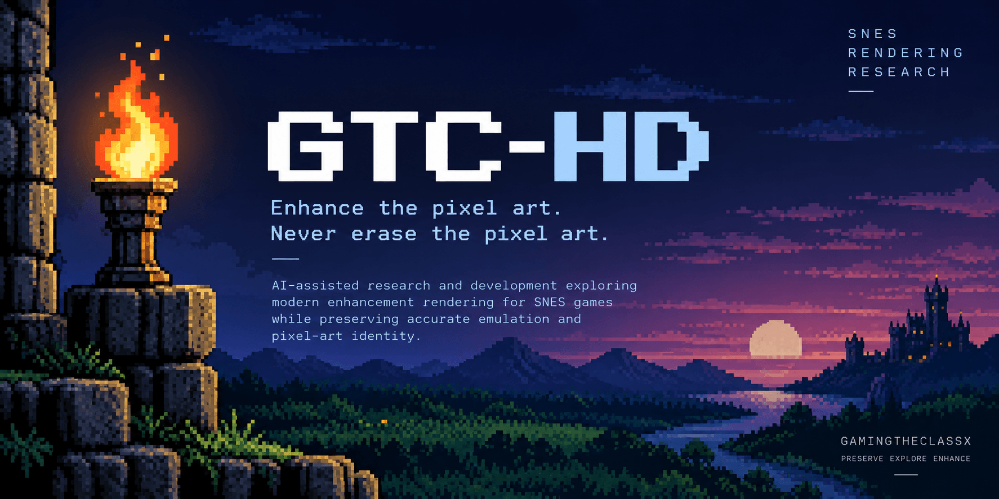
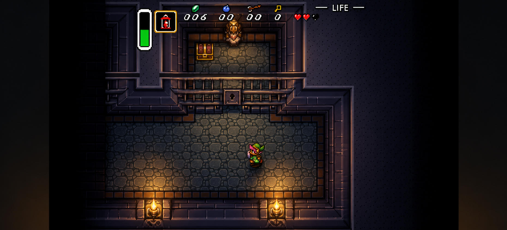

# GTC-HD

> **Enhance the pixel art. Never erase the pixel art.**

GTC-HD is an experimental graphics-engineering project exploring modern enhancement rendering for Super Nintendo Entertainment System games. The ambition is to enrich familiar worlds while preserving their original pixel artwork and recognizable visual identity.

Original game behavior, accurate emulation, and faithful SNES rendering semantics come first. Every enhancement must serve the artwork: its shapes, colors, animation, and readability. The feeling we are working toward is:

> **“This looks like the SNES game I remember — except somehow it looks alive.”**

The project is currently in research and architecture. This repository documents the engineering process and is intended to eventually house the GTC-HD implementation.

## The rendering idea

Traditional enhancement works from a completed image:

```text
SNES → completed low-resolution framebuffer → upscale / post-process
```

GTC-HD is investigating a different starting point: preserve useful information while the native graphics pipeline still knows where each sample came from and how it participates in the image.

The **architectural hypothesis**, still under investigation, is:

```text
SNES execution
    → accurate PPU behavior
    → preserved useful graphics semantics
    → GTC-HD rendering representation
    → future modern renderer
    → enhanced presentation
```

The PPU, or Picture Processing Unit, turns SNES graphics data into pixels. Useful context may include background and sprite origins, source coordinates, priority relationships, window masks and composition decisions, color-math relationships, and timing. Preserving that context could help a future renderer make informed enhancement decisions before those relationships disappear into final colors.

This is a hypothesis, not accepted architecture or a completed interface. The research must determine what information is sufficient, where to preserve it, and how to retain accurate native behavior and original rendering as a reference.

> **Capture as much useful information as necessary, not indiscriminately everything.**



> **Concept visualization — not current GTC-HD output.**
> This image illustrates the kind of presentation GTC-HD is exploring: preserved pixel art combined with richer lighting, shadows, depth, and higher-resolution rendering. It depicts a visual direction, not implemented features.

## What we want to build

The long-term aim is a modern rendering system that enriches SNES presentation while keeping the source artwork recognizable. Research and development targets include:

- **Resolution and motion:** higher-resolution reconstruction, improved transformations and scrolling, and widescreen research.
- **Light and space:** dynamic lighting, emissive sprites and tiles, shadows, and approximate depth and layer relationships.
- **Art and presentation:** enhanced materials, optional higher-resolution assets, modern GPU rendering, and easy comparison between original and enhanced views.

These are development targets, not completed features. Their value will be judged by how well they support the original artwork and preserve pixel-art readability.

## Universal enhancement + optional profiles

The preferred product direction is:

```text
Universal GTC-HD enhancement + optional game profile
```

The goal is for unfamiliar compatible SNES games to receive useful enhancement without requiring a manual remaster for each title. How broadly that can work remains a research question.

Optional profiles could later supply knowledge that graphics data alone cannot reliably explain: depth hints, asset identity, lighting and emissive metadata, materials, room or level behavior, enhanced assets, and widescreen rules. They would enrich the universal foundation with game-specific context.

The profile format and any scripting language remain undecided.

## Provisional roadmap

This roadmap describes intended areas of work. Its sequence and scope may change as research invalidates or reshapes assumptions.

- **Phase 0 — Research and Architecture · Current:** Understand SNES rendering and determine what information a future enhancement renderer needs.
- **Phase 1 — Foundation:** Select an initial emulator/core and establish the first production architecture.
- **Phase 2 — Graphics-State Interface:** Define and expose the useful PPU and graphics information required by GTC-HD.
- **Phase 3 — Independent Rendering:** Render selected SNES graphical components through a modern pipeline while retaining original rendering as a reference.
- **Phase 4 — Universal Enhancement:** Introduce useful enhancements that require no game-specific profile.
- **Phase 5 — Game Profiles:** Add optional game-specific metadata and richer behavior.
- **Phase 6 — Spatial Interpretation:** Investigate layer relationships, depth, parallax, and related spatial information.
- **Phase 7 — Lighting:** Explore dynamic lighting, emissive behavior, and related effects while preserving pixel-art readability.
- **Phase 8 — Enhanced Assets:** Explore optional replacement assets, materials, normal/emissive maps, and supporting workflows.
- **Phase 9 — Showcase Experiences:** Develop richer GTC-HD experiences for GamingTheClassX demonstrations.

## Current status

**Phase 0 — Discovery / Research / Architecture.**

Source research and focused experiments are being used to validate whether sufficiently rich PPU semantics can be preserved for a future renderer. No production GTC-HD renderer exists yet.

Foundational choices remain intentionally unresolved: no emulator/core, programming language, graphics API, renderer architecture, or game-profile format has been selected. bsnes is a research target, not an accepted foundation.

## Research documentation

Explore [docs/](docs/) for source-code research, emulator architecture investigations, experiment specifications and results, and architecture decisions as they mature. [Project State](docs/PROJECT_STATE.md) records the project's phase, priorities, and unresolved foundations.

Detailed evidence belongs there; architectural choices must be supported before becoming production commitments.

## AI-assisted engineering

GTC-HD uses AI assistance for source analysis, research, experiment design, implementation, testing, documentation, and architecture exploration. Technical claims are expected to rest on inspected source, reproducible experiments, measured results, and explicit decisions.

AI supports a directed engineering process. Evidence remains the authority.

## GamingTheClassX

GTC-HD is a technical and creative extension of GamingTheClassX. The eventual goal is a distinctive presentation for classic SNES games beyond what loading a ROM into an ordinary emulator with ordinary settings would provide: familiar artwork with greater richness, atmosphere, and life.

## ROMs and licenses

ROM files are not part of this repository. Users are responsible for providing their own legally obtained game content. Upstream emulator projects retain their respective licenses.

> **Enhance the pixel art. Never erase the pixel art.**
