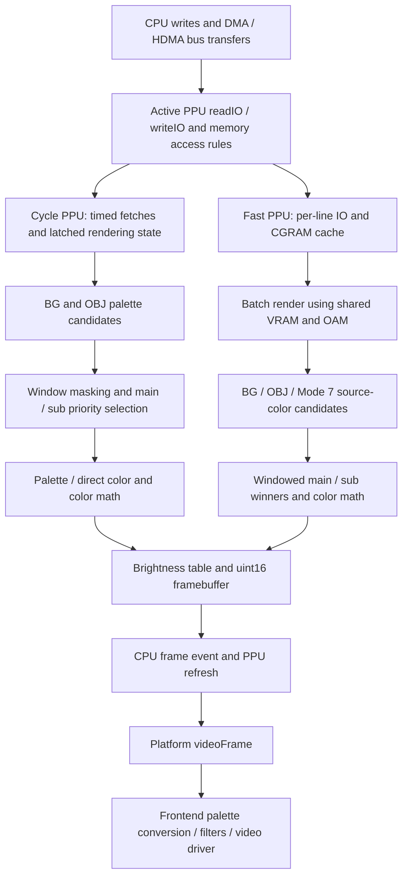

# bsnes PPU and Rendering Architecture Audit

Research date: September 18, 2026. Status: research evidence for GTC-HD Phase 0. **bsnes remains a research target; neither an emulator foundation nor an interception boundary is selected by this report.**

Evidence labels used throughout:

- **SOURCE OBSERVATION**: directly visible in the inspected checkout, including explicitly identified upstream comments.
- **INFERENCE**: a conclusion derived from that implementation, without runtime validation.
- **HYPOTHESIS**: a possible GTC-HD design or experiment, not an accepted decision.
- **UNKNOWN**: unresolved by this static audit.

All source paths below are relative to the bsnes repository root, unless explicitly described as workspace paths. Line numbers refer only to the commit recorded below. Names such as `PPUfast::Line` refer to the compiled type: the fast implementation uses preprocessor aliases so many of its definitions are spelled `PPU::Line` in the source.

For compact repeated citations, `ppu/` expands to `bsnes/sfc/ppu/`, `fast/` to `bsnes/sfc/ppu-fast/`, and `program/` to `bsnes/target-bsnes/program/`. A bare filename within a pipeline discussion refers to that discussion's already identified directory. Section 4 lists the full source locations.

## 1. Repository Identity

**SOURCE OBSERVATION — verified before substantive inspection.**

| Item | Observed value |
|---|---|
| GTC-HD workspace root | `<GTC-HD-Lab>` |
| Research repository root | `upstream/bsnes` |
| Separate repository | Yes; its own `.git` directory and matching `git rev-parse --show-toplevel` |
| Origin | `https://github.com/bsnes-emu/bsnes.git` |
| Current branch | `master` |
| Exact HEAD | `7d5aa1e656b9171524d01b1b22917197d8121cb4` |
| Expected revision | Exact branch and SHA match; no mismatch |
| `git describe --tags --always` | `nightly` |
| Source version | `Emulator::Version = "115"`; serializer version `115.1`, in `bsnes/emulator/emulator.hpp:32,38` |
| Initial working tree | Clean according to `git status --porcelain=v1` |

The workspace `AGENTS.md` and `project/GTC-HD_PROJECT_STATE.md` were read. They establish project authority under `project/`, read-only upstream research, and the priority of correct behavior, accurate execution, and faithful rendering over enhancement. The canonical project phase is **Phase 0 — Discovery / Research / Architecture**; the emulator/core and PPU interception boundary are **INVESTIGATING**.

Research question: where can GTC-HD obtain rich graphics state for an independent enhancement renderer while retaining accurate SNES execution?

Method: static source inspection of both SNES PPU implementations, CPU/HDMA synchronization, serialization, core video callbacks, desktop presentation, and the libretro video adapter. No compilation, ROM execution, benchmarks, hooks, or upstream modifications were performed. Consequently, implementation behavior is distinguished from demonstrated hardware accuracy and demonstrated export feasibility.

## 2. Executive Summary

1. **SOURCE OBSERVATION:** There are two materially different PPU implementations. `bsnes/sfc/ppu/` advances through two-clock steps with scheduled BG fetches, OBJ evaluation/fetch, windows, and pixel composition. `bsnes/sfc/ppu-fast/` caches scanline state and renders batches, optionally through OpenMP. `System::power()` and `PPU::power()` select one active implementation; this is not one state owner with two interchangeable output plugins. Evidence: `bsnes/sfc/system/system.cpp:188`, `bsnes/sfc/ppu/ppu.cpp:76`, `bsnes/sfc/ppu/main.cpp:187`, `bsnes/sfc/ppu-fast/line.cpp:4`.

2. **SOURCE OBSERVATION:** Rich source identity is transient. A normal BG retains character-row address, character number, palette group, flips, and priority in `Background::Tile`, but its emitted `Pixel` contains only priority and palette fields. OBJ item records retain OAM index; fetched OBJ tile records do not. Fast-path `Pixel` retains only source category, priority, and resolved color. **INFERENCE:** No existing late pixel boundary supplies full tilemap and individual-sprite provenance. Evidence: `bsnes/sfc/ppu/background.hpp:46,70`, `bsnes/sfc/ppu/object.hpp` (`Item`, `Tile`, `Output`), `bsnes/sfc/ppu-fast/ppu.hpp:229,236,246`.

3. **SOURCE OBSERVATION:** Cycle-path rendering affects CPU-visible PPU behavior. `Screen::paletteColor()` updates `latch.cgramAddress`; OBJ evaluation/fetch update `latch.oamAddress`; active-display memory access uses those latches; sprite evaluation produces overflow flags readable through `$213e`. **INFERENCE:** Simply removing the original rendering work can change execution-visible behavior. Evidence: `bsnes/sfc/ppu/screen.cpp:147`, `bsnes/sfc/ppu/object.cpp:36,94`, `bsnes/sfc/ppu/io.cpp:46–69,170`.

4. **SOURCE OBSERVATION:** Fast `Line::cache()` copies IO and CGRAM, not VRAM or OAM. Accepted VRAM writes and OAM writes flush pending lines before mutation. Its header explicitly documents lack of mid-scanline effects, inexact vertical mosaic, and lack of the 128 KiB VRAM hardware modification. **INFERENCE:** A frame snapshot is insufficient, and even a copied fast `Line` is not a self-contained external rendering packet. Evidence: `bsnes/sfc/ppu-fast/line.cpp:28`, `bsnes/sfc/ppu-fast/io.cpp:31,48`, `bsnes/sfc/ppu-fast/ppu.hpp:1–7`.

5. **SOURCE OBSERVATION:** This bsnes checkout already includes HD Mode 7 in the fast PPU. It changes sampling, uses neighboring/grouped scanline matrices, expands intermediate pixel grids, and integrates with priority, windows, and color math. The implementation even documents a rendering-order workaround for an EXTBG case. **INFERENCE:** Enhancement is entangled with composition and temporal state; HD Mode 7 is useful precedent, not proof of a universal independent-renderer interface. Evidence: `bsnes/sfc/ppu-fast/mode7hd.cpp`, `bsnes/sfc/ppu-fast/line.cpp:70–81`, `bsnes/sfc/ppu-fast/ppu.cpp:119–125`.

6. **HYPOTHESIS:** An observational side channel alongside the intact cycle PPU could retain a native reference image while exporting timed state or provenance. It requires new instrumentation and experiments; there is no verified ready-made interface in the inspected paths. The evidence supports comparing several boundaries, not selecting one. The `Emulator::Platform::videoFrame()` boundary is straightforward for completed pixels but already too late for reliable graphics identity (`bsnes/emulator/platform.hpp:19`).

## 3. High-Level Rendering Pipeline

**SOURCE OBSERVATION — core selection and ownership.** `bsnes/sfc/GNUmakefile` builds both `sfc-ppu` and `sfc-ppu-fast`. The globals are `SuperFamicom::ppu` and `SuperFamicom::ppufast`. `PPU::power()` creates either `PPU::Enter` or `PPUfast::Enter` on the base PPU's thread and maps that implementation's IO handlers to `00-3f,80-bf:2100-213f`. `PPUfast` has its own VRAM, CGRAM, decoded objects, IO, counter, and output; it shares base thread clock and display metadata through `ppubase`. A plugin reading `ppu.vram` while fast mode is active would be reading the wrong state owner.

**SOURCE OBSERVATION — source-grounded flow.**

The diagram's branches are alternatives selected at power, not simultaneous rendering of one shared PPU state. Supporting calls: `CPU::Channel::writeB()` in `bsnes/sfc/cpu/dma.cpp:82`; both `writeIO()` implementations; `PPU::cycle()` and `cycleRenderPixel()` in `bsnes/sfc/ppu/main.cpp:180–195`; `PPUfast::Line::{cache,flush,render}` in `bsnes/sfc/ppu-fast/line.cpp`; `CPU::scanline()` in `bsnes/sfc/cpu/timing.cpp:97`; `System::frameEvent()` in `bsnes/sfc/system/system.cpp:109`.

**SOURCE OBSERVATION — timing and threads.** `Scheduler` and `Thread` in `bsnes/sfc/sfc.hpp` use libco `co_switch`/`co_create`: CPU and PPU emulation execute as cooperative cothreads. `CPU::step()` subtracts clocks from `ppu.clock`; `CPU::synchronizePPU()` resumes a lagging PPU; `PPU::step()` advances two clocks and yields back when caught up. Fast `step(clocks)` advances larger intervals and uses the same base clock. Separately, `Line::flush()` contains `#pragma omp parallel for if(Line::count >= 8)`, so batch rasterization may use actual parallel workers. Runtime worker count was not measured.

`PPUcounter::tickScanline()`/`hdot()` in `bsnes/sfc/ppu/counter/counter-inline.hpp` model region, field, interlace, ordinary 1364-clock lines, exceptional short/long lines, and nonuniform dot lengths. Consequently, an H-counter value, a dot, a rendered pixel, and an HD output sample are different coordinates.

## 4. Important Files and Components

**SOURCE OBSERVATION.** This is a navigation index for the evidence used in the remaining sections.

| Repository-relative location | Important component or purpose |
|---|---|
| `bsnes/sfc/sfc.hpp` | `Scheduler`, `Thread`, libco execution and component inclusion |
| `bsnes/sfc/system/system.cpp` | `System::power`, `run`, `frameEvent`, synchronization for saves |
| `bsnes/sfc/interface/configuration.hpp` | PPU selection and enhancement defaults; render cycle defaults to 512, Mode 7 scale to 1 |
| `bsnes/sfc/cpu/cpu.cpp:17` | `CPU::synchronizePPU` |
| `bsnes/sfc/cpu/timing.cpp:97` | `CPU::scanline`, HDMA scheduling and frame event |
| `bsnes/sfc/cpu/dma.cpp:82,86,172` | `Channel::writeB`, `transfer`, `hdmaTransfer` |
| `bsnes/sfc/ppu/ppu.hpp` | Cycle PPU state owner, VRAM, latches, output, component instances |
| `bsnes/sfc/ppu/ppu.cpp:46,76,189` | Two-clock stepping, path selection/IO mapping, refresh |
| `bsnes/sfc/ppu/main.cpp` | `main`, scheduled `cycle`, BG fetch sequence, OBJ and composition order |
| `bsnes/sfc/ppu/io.cpp` | CPU-facing register/memory semantics and `updateVideoMode` priority tables |
| `bsnes/sfc/ppu/background.hpp` and `background.cpp` | BG registers, tile cache, tiled fetch/decode, mosaic and palette candidates |
| `bsnes/sfc/ppu/object.hpp`, `object.cpp`, `oam.cpp` | Decoded OAM, evaluation, tile fetch, limits and OBJ overlap |
| `bsnes/sfc/ppu/mode7.cpp:6` | `Background::runMode7`, affine source lookup |
| `bsnes/sfc/ppu/window.cpp:5,41` | `Window::run`, `test`, masks and candidate suppression |
| `bsnes/sfc/ppu/screen.hpp` and `screen.cpp` | CGRAM, main/sub winner selection, direct color, math, brightness output |
| `bsnes/sfc/ppu/mosaic.cpp` | Vertical mosaic counter |
| `bsnes/sfc/ppu/counter/counter-inline.hpp` | Clock, scanline, dot, field and region behavior |
| `bsnes/sfc/ppu-fast/ppu.hpp` and `ppu.cpp` | Fast state, `Line`, `Pixel`, own memories, batch scheduling, output dimensions |
| `bsnes/sfc/ppu-fast/io.cpp:31,48,69` | VRAM/OAM flush ordering and CGRAM mutation |
| `bsnes/sfc/ppu-fast/line.cpp` | Per-line caches, OpenMP flush, winners, color math and output |
| `bsnes/sfc/ppu-fast/background.cpp` and `object.cpp` | Scanline BG/OBJ rasterization and early identity collapse |
| `bsnes/sfc/ppu-fast/mode7.cpp` and `mode7hd.cpp` | Native-scale and enhanced Mode 7 |
| `bsnes/sfc/ppu-fast/window.cpp` | Per-line layer and color-window masks |
| `bsnes/sfc/ppu/serialization.cpp`, `bsnes/sfc/ppu-fast/serialization.cpp`, `bsnes/sfc/system/serialization.cpp` | Saved internal state and PPU-path compatibility check |
| `bsnes/emulator/platform.hpp:19` | `Platform::videoFrame(const uint16*, pitch, width, height, scale)` |
| `bsnes/target-bsnes/program/platform.cpp:205`, `video.cpp`, `filter.cpp` | Desktop callback, display palette, filters and presentation |
| `bsnes/filter/none.cpp` | 16-bit core color to 32-bit display color lookup |
| `bsnes/target-libretro/program.cpp:302` | Alternate frontend conversion and `video_cb` |
| `bsnes/target-bsnes/program/hacks.cpp:1` | Documented game-specific fast-PPU fallbacks and render-cycle changes |

## 5. PPU State Availability Matrix

The storage and transformation columns are **SOURCE OBSERVATION**. The final column is **INFERENCE** about export requirements. Raw memory can remain globally present while the association between a particular output pixel and the historical memory value has already been lost.

| Category | Cycle PPU representation and access | Fast PPU representation and transformation | Consequence for capture |
|---|---|---|---|
| VRAM | `PPU::VRAM` in `bsnes/sfc/ppu/ppu.hpp:49`; word-addressed storage of 65536 words with default mask `0x7fff`; `load()` accepts `0xffff` for the 128 KiB extension | `uint16 vram[32768]` in `bsnes/sfc/ppu-fast/ppu.hpp:276`; shared across `Line` jobs | Normal accessible capacity is 64 KiB, not 64 Ki words. Export address units and memory versions explicitly. |
| CGRAM/palette | `Screen::cgram[256]` (`uint15`), `screen.hpp:19`; palette lookup in `screen.cpp:147` | `uint16 cgram[256]` plus each `Line::cgram`; `Line::cache()` copies it | Resolved colors no longer identify the palette entry; retain index and palette version for palette-aware enhancement. |
| OAM/sprites | `Object::oam.object[128]`, `OAM::read/write` in `object.hpp`, `oam.cpp` | `objects[128]`; `readObject/writeObject` in fast `object.cpp` normalize Y with a +1/-1 convention | Export actual OAM identity and coordinate convention; current OAM is not historical scanline OAM. |
| PPU registers | Distributed among `PPU::IO`, BG/OBJ/window/screen IO, mosaic, and `Latch`; `ppu/io.cpp::writeIO` | Consolidated `PPUfast::IO`, `Latch`; fast `io.cpp::writeIO` | A register dump omitting latches/counters is not a complete rendering state. |
| BG configuration | `Background::IO`: map/data bases, sizes, mode, enables, offsets (`background.hpp:30`) | `IO::Background` in fast `ppu.hpp`, copied per line | Available before rasterization; not carried into final colors. |
| Tilemaps | VRAM words read by `Background::fetchNameTable()` (`background.cpp:29`) | `Line::getTile()` (`fast/background.cpp:146`) returns attributes | Exact map cell/address is local to lookup, not part of emitted pixels. |
| Tile graphics | `Background::Tile::address`, `character`, `data[4]`; `fetchCharacter()` interleaves bitplanes | Row address/data and tile number are locals in `renderBackground()` | Preserve fetch-time identity; a tile number alone does not identify immutable art. |
| BG modes | `io.bgMode`, BG `mode`, `updateVideoMode()` (`ppu/io.cpp:653`) | `io.bgMode`, BG `tileMode`, fast `updateVideoMode()` | Numeric priorities and decoding depend on mode and BG-priority setting. |
| Scrolling | BG `hoffset/voffset`, shared write latches, BG3 `opt`; `fetchNameTable/fetchOffset` | Per-line offsets plus `getTile()` offset-per-tile lookups | Source coordinates can differ by tile and time; one layer-wide frame transform is insufficient. |
| Tile priority | Attribute bit 13 becomes mode-dependent `Tile::priority`, then BG `Pixel::priority` | Attribute bit becomes `tilePriority` and `Pixel::priority` | Numeric rank survives briefly; raw attribute and map association do not. |
| Sprite priority | OAM priority, `Object::Tile::priority`, then mapped `Output::Pixel::priority` | `ObjectTile::priority`, per-x priority array, then fast `Pixel` | OAM overlap ordering is resolved separately from BG/OBJ rank; preserve both where needed. |
| Main/sub screens | Per-BG/OBJ `aboveEnable/belowEnable`; `output.above/below` | Same enables in IO and `Line::above/below` arrays | Two independently resolved screens feed math and hires output; cannot flatten early. |
| Windows | `Window::IO`, `test/run`; modifies candidate priority and color-enable outputs | `renderWindow()` masks filter plotting and final color math | Post-window pixels do not explain which mask rejected a candidate. |
| Mosaic | `PPU::Mosaic` vertical counter; BG horizontal counter, held `Pixel` | Per-line mosaic size/counter and held color/priority in BG/Mode 7 render loops | The displayed pixel can come from an earlier sample; provenance must follow the held sample. |
| Color math | `Screen::IO`, `Math`, `above/below/blend/fixedColor` | `IO::Color`, `Line::pixel/blend` | Operands, source eligibility, clipping and halving disappear into one color. |
| Mode 7 | `PPU::IO` matrix/center/offset/repeat/flip fields; `runMode7()` locals | `IO::Mode7`, native/HD render methods, `mode7LineGroups` | Source tile/coordinate exists during sampling; HD interpolation also depends on other lines. |
| Per-line/mid-frame state | Live registers plus prefetched BG rows, alternating OBJ buffers, mosaic/math history, clock and field | `Line::io/cgram`; shared VRAM/OAM guarded by flushes; global frame latches | No complete frame history is exported. Capture effective state at the consumption time or preserve an adequate event history. |
| Brightness/forced blank | `$2100`, live `io.displayBrightness/displayDisable`; `Screen::run/above/below` | Per-line IO; early blank-line return and brightness table | Already applied in framebuffer; prior unattenuated values cannot generally be recovered. |

## 6. Background Pipeline

**SOURCE OBSERVATION — representative normal path: mode 1, BG1, 4 bpp.**

1. `PPU::writeIO($2105)` sets BG mode and tile sizes; `updateVideoMode()` chooses BG1 `BPP4` and two numeric priority ranks. `$2107` chooses BG1 tilemap base/size, `$210b` chooses graphics base, and `$210d/$210e` update scrolling through shared latches. Evidence: `bsnes/sfc/ppu/io.cpp:252,279,307,321,332,653`.
2. `PPU::cycleBackgroundFetch<Cycle>()` selects the mode-specific interleaving of tilemap and character fetches. BG1 mode 1 fetches use the name-table phase and two character-plane phases (`bsnes/sfc/ppu/main.cpp:81`).
3. `Background::fetchNameTable()` derives screen X from the PPU H counter and Y from V counter, applies scroll, hires/interlace adjustments and vertical mosaic, and, in modes 2/4/6, consumes BG3 offset-per-tile state. It wraps coordinates to configured map dimensions, derives map tile coordinates and screen-quadrant offset, and reads `vram[screenAddress + offset]` (`bsnes/sfc/ppu/background.cpp:29–115`).
4. The map word supplies character bits 0–9, palette group bits 10–12, priority bit 13, and H/V flip bits 14/15. Large tiles/hires can adjust the selected sub-character. `Tile::address` becomes the **character-row address**, not the tilemap-entry address. For 4 bpp, the address stride is 16 words per character and the palette group selects a 16-entry palette.
5. `fetchCharacter(index, half)` reads row bitplanes at `tile.address + (index << 3)`, reverses orientation when needed and interleaves plane pairs into `Tile::data`. `begin()` discards a scrolled partial column. `run()` extracts a pixel from the cached planes and shifts that cache (`background.cpp:152,174`).
6. `run()` forms `{priority, palette, paletteGroup}`, treats zero color as transparent, applies horizontal mosaic by holding a prior `Pixel`, and publishes enabled main/sub outputs. `Window::run()` can suppress them. `Screen::above/below()` chooses the winning layer and resolves CGRAM or direct color (`bsnes/sfc/ppu/window.cpp:5`, `screen.cpp:32,71`).

**INFERENCE — latest useful identity.** For full BG identity including exact map cell and map address, `fetchNameTable()` is the last place all that information exists together. At `run()` the BG instance ID, current tile cache entry, row address, adjusted character, palette group and rank still exist, but map coordinates/address were not retained. They cannot safely be reconstructed from current registers after intervening writes. An observational implementation would need to carry fetch provenance alongside the tile cache and alongside the mosaic-held sample. `Background::output` alone supplies only partial identity.

**SOURCE OBSERVATION — fast path difference.** `Line::renderBackground()` in `bsnes/sfc/ppu-fast/background.cpp:1` performs a whole line's map lookup, decoding, palette/direct-color resolution, mosaic, window test and plotting. `getTile()` retains map-address calculation only locally. Immediately before `plotAbove/plotBelow`, locals still identify source BG, character-row address and palette, but the plotting API accepts only X, source category, priority and color. Its loop's current tile is not necessarily the origin of a held mosaic color. Provenance would have to track that held origin explicitly.

## 7. OBJ / Sprite Pipeline

**SOURCE OBSERVATION — cycle path.** `PPU::OAM` stores 128 decoded objects with X/Y, character number, name-table selection, size, palette, priority and flips (`bsnes/sfc/ppu/object.hpp:1`; packing and unpacking are in `oam.cpp`). Size tables and an interlace size quirk are implemented by `OAM::Object::width/height()`.

`Object::scanline()` latches the first sprite for priority rotation, toggles the double-buffered item/tile sets and resets evaluation counters. `PPU::cycle()` calls `evaluate(hcounter >> 3)` at eight-clock intervals. `evaluate()` selects `(firstSprite + index)` with 7-bit wrap, checks horizontal/vertical eligibility via `onScanline()`, updates the OAM address latch and stores up to 32 `{valid,index}` items. The extra qualifying item records overflow (`bsnes/sfc/ppu/object.cpp:17–58`).

At H=1080, `PPU::main()` calls `Object::fetch()`. It walks selected items in reverse, uses the OAM index to retrieve the object, derives row/field/flips and character bank, clips fully offscreen tiles, and fetches up to 34 tile rows. It performs two four-clock steps per fetched row, with forced-blank checks around reads. It sets `rangeOver/timeOver`; those feed `$213e` (`object.cpp:94–164`; `ppu/io.cpp:170`).

`Object::run()` consumes the other tile buffer: selection/fetch for a line and output consumption are pipelined across lines. It determines coverage at current X, decodes four bitplanes and overwrites the OBJ palette/priority output for nonzero samples in its traversal order (`object.cpp:60`). OBJ overlap therefore is not simply a maximum of OAM priority bits. The resulting OBJ candidate participates in window masking and BG/OBJ priority selection. Palettes below 192 are excluded from OBJ color math by `Screen::above()` (`screen.cpp:99–102`).

**INFERENCE — identity lifetime.** The last explicit association between a tile fetch and an OAM object is inside `Object::fetch()`, while `oamItem[i].index`, the sprite reference, row and tile address are in scope. `Object::Tile` contains no OAM index or source VRAM address. At `run()`, even before BG composition, an arbitrary tile row cannot reliably be assigned back to an individual OAM object without previously recorded provenance. The item list may still exist, but it does not provide an explicit per-tile/per-pixel ownership link. OAM index itself is a hardware slot, not a persistent game-entity ID.

**SOURCE OBSERVATION — fast path.** `PPUfast::Line::renderObject()` in `bsnes/sfc/ppu-fast/object.cpp:1` selects `ObjectItem` entries with OAM index, builds `ObjectTile` entries without that index, decodes them into per-X palette/priority arrays, then plots source `OBJ1` or `OBJ2` depending on palette range. These names denote color-math eligibility groups, not individual sprites. `ItemLimit/TileLimit` are 32/34 normally or 128/128 under `noSpriteLimit` (`fast/ppu.cpp:197–198`). Fast object storage adjusts OAM Y by +1 on write and -1 on read to model line delay (`fast/object.cpp:140,169`). Captures from the two paths require normalization rather than blindly equating their internal Y fields.

## 8. Mode 7 Pipeline

**SOURCE OBSERVATION — cycle Mode 7.** `$211a–$2120` and `$210d/$210e` populate repeat/flip, matrix A/B/C/D, center X/Y and offset fields in `PPU::IO`, using `latch.mode7` for paired writes (`bsnes/sfc/ppu/io.cpp:321–340,424–471`). `updateVideoMode()` enables BG1 Mode 7 and optionally BG2 under EXTBG.

`Background::runMode7()` in `bsnes/sfc/ppu/mode7.cpp:6` sign-interprets the matrix and center/offset values, chooses mosaic-adjusted screen coordinates and flips, computes fixed-point affine origins with truncation masks, then obtains `pixelX/pixelY`. It reads a map tile from the low byte of a VRAM word indexed by a 128-by-128 tilemap and a palette index from the high byte of character data. Repeat mode 2 makes outside pixels transparent; repeat mode 3 selects tile zero outside; masked coordinates handle wrapping in the other cases.

BG2 EXTBG uses palette bit 7 for priority and then removes it from the palette index. The result enters the same BG `output.above/below` candidate structures used by tiled BGs. For BG1 direct color, later `Screen` composition uses a palette group of zero. Matrix/source tile/source coordinate semantics are locals in `runMode7()` and are not retained in the candidate.

**SOURCE OBSERVATION — fast and HD Mode 7.** `Line::renderMode7()` in `bsnes/sfc/ppu-fast/mode7.cpp:1` performs native-scale scanline sampling, or dispatches to `renderMode7HD()` when scale exceeds one and the mosaic option does not require the native path. This functionality is in this bsnes checkout; no bsnes-HD repository was inspected or assumed equivalent.

`Line::cacheMode7HD()` groups cached Mode 7 lines and chooses interpolation endpoints, with heuristics intended to reject unsuitable perspective patterns. `renderMode7HD()` uses floating-point interpolation of reciprocal matrix coefficients, fractional sample positions and repeated texture lookup over a scale-by-scale grid per native pixel (`bsnes/sfc/ppu-fast/mode7hd.cpp:2,98`). It can average enhanced samples back into native-sized candidates when supersampling is selected. The existence of these branches is observed; the numerical correctness of every heuristic and averaging case is untested.

`PPUfast::scanline()` latches whether any visible line requests HD or supersampling; EXTBG disables supersampling in favor of HD (`fast/ppu.cpp:119–125`). `Line::plotHD()` replicates ordinary BG/OBJ pixels into the larger grid while handling hires/interlace subdivisions. HD Mode 7 writes that grid directly. Color-window coordinates remain based on native X. `Line::render()` changes EXTBG BG2 ordering and explicitly identifies a workaround for Mohawk & Headphone Jack (`fast/line.cpp:70–81,154`).

**INFERENCE — lessons beyond Mode 7.** High-resolution sampling can change which layer wins within a native pixel, making shared priority/window/math semantics central to enhancement. Dependencies on multiple scanlines complicate incremental flush and asynchronous export. A matrix stream also does not establish a game's camera or geometry: those would be inferred scene semantics. HD Mode 7 demonstrates integration work within a PPU renderer, not a proven separation from it.

**UNKNOWN:** Correctness and robustness across perspective discontinuities, early VRAM/OAM-triggered flushes, EXTBG, interlace, mosaic and supersampling require runtime tests. A declaration for `renderMode7HD_AVX2` exists in the header, but the inspected compiled inclusion path uses `mode7hd.cpp`; the declaration alone is not evidence of an active additional renderer.

## 9. Composition / Priority / Windows

**SOURCE OBSERVATION — cycle composition.** `PPU::cycleRenderPixel()` calls `obj.run()`, `window.run()`, then `screen.run()` after BG outputs have been produced (`bsnes/sfc/ppu/main.cpp:180`). The individual BG/OBJ outputs have separate main (`above`) and sub (`below`) candidates. Main/sub enable bits come from `$212c/$212d`; window enables from `$212e/$212f` (`bsnes/sfc/ppu/io.cpp:570–607`).

`Window::test()` combines two inclusive horizontal ranges, each independently enabled/inverted, using OR, AND, XOR or XNOR. `Window::run()` suppresses selected layer candidates by setting priority to zero, and computes separate final-color clipping/math permissions. Layer windowing and color windowing are distinct operations (`bsnes/sfc/ppu/window.cpp:5,41`).

`Screen::below()` and `above()` compare BG1, BG2, BG3, BG4 and the already-resolved OBJ candidate. Priority ranks come from `updateVideoMode()`, not just raw map/OAM priority bits. BG1 establishes the initial candidate and later layers replace it only with a strictly greater rank. The backdrop is CGRAM entry zero. `Screen::Math` retains colors and math flags, but no source-layer enum (`bsnes/sfc/ppu/screen.cpp:32,71`; `screen.hpp:36`).

**INFERENCE — latest source-layer boundary.** Cycle `Background::output` and `Object::output` retain layer identity through their owning instances until `Screen::above/below()` collapses candidates into math state. Before `Window::run()` they additionally retain candidates that windows will suppress. A post-selection interception inside `Screen` could record the chosen layer, but would need new provenance fields; the returned color alone cannot identify it.

**SOURCE OBSERVATION — fast composition.** `renderBackground/renderObject/renderMode7` apply layer windows before plotting. Native `plotAbove/plotBelow()` update a pixel only if the new rank is greater, immediately discarding the losing candidate. `Line::above/below` retain `{source,priority,color}` for the winners; `Source` distinguishes BG1–BG4, two OBJ palette classes, and COL/backdrop. Their source enum survives until `Line::pixel()` performs color math (`bsnes/sfc/ppu-fast/line.cpp:106,143,148`; `ppu.hpp:42,246`). HD Mode 7 has direct writes and ordering dependencies, so intercepting only `plotAbove/plotBelow()` would miss that path.

## 10. Color Math

**SOURCE OBSERVATION — cycle path.** `Screen::above()` decides eligibility from the winning source's color-enable setting, with OBJ palette restrictions; applies color-window controls; chooses fixed color or the sub-screen color; and handles a transparent sub-screen fallback. `io.colorHalve` is further gated by clipping/transparency conditions. `Screen::blend()` implements component-wise saturated addition or subtraction and half-color variants through 15-bit integer carry/borrow masks. `fixedColor()` constructs a BGR555 value from separately writable components (`bsnes/sfc/ppu/screen.cpp:71–163`; `$2130–$2132` in `ppu/io.cpp:610–637`). This is SNES color arithmetic, not generic alpha blending.

In hires/pseudo-hires, `Screen::run()` calls `below(hires)` before `above()`. The below computation uses persistent `Math` values left by preceding work, then the above computation updates them. `scanline()` initializes this history, and its comment explicitly says exact initial values are not confirmed on hardware (`screen.cpp:1–29,62–68`). **INFERENCE:** Replacing these calls with one stateless blend per native pixel could lose horizontal hires behavior; the order and history need validation.

**SOURCE OBSERVATION — fast path.** `Line::pixel(x, above, below)` clips above color to black when the color window disallows it, gates math through the second window and `io.col.enable[above.source]`, then blends with fixed color or the below color. Halving is conditioned on the clipping permission and, for sub-screen blending, whether below is `Source::COL`. Hires output calls `pixel()` with reversed operands for the sub sample and normal operands for the main sample (`bsnes/sfc/ppu-fast/line.cpp:84–132`). The fast implementation's stateless-looking pixel function must not be assumed equivalent to cycle `Screen::Math` history; frontend compatibility comments explicitly note color-math and pseudo-hires differences (`bsnes/target-bsnes/program/hacks.cpp:15–19`).

**SOURCE OBSERVATION — final production.** Both paths index a brightness lookup table after color math. Forced blank yields black. The tables also swap the SNES internal red/blue bit placement into the frontend's RGB555 ordering (`bsnes/sfc/ppu/ppu.cpp`, constructor; `screen.cpp:28–29`; `bsnes/sfc/ppu-fast/ppu.cpp`, constructor; `line.cpp:84–102`).

**INFERENCE:** The final many-to-one collapse occurs at `blend()` and clipping, followed by brightness quantization. Capturing immediately before these operations can preserve operands and controls; a blended output pixel cannot uniquely reveal original main/sub colors or source identity. Reproducing color math outside bsnes remains possible in principle but becomes an explicitly required part of the renderer's compatibility work.

## 11. Output Pipeline

**SOURCE OBSERVATION — core buffers and format.**

| Stage | Representation and behavior |
|---|---|
| Palette/direct-color/math values | Fifteen meaningful bits with red in bits 0–4, green 5–9, blue 10–14, as shown by `Screen::fixedColor/directColor` |
| Brightness table output | Fifteen meaningful RGB bits: red 10–14, green 5–9, blue 0–4, held in `uint16`; this is not RGB565 |
| Cycle framebuffer | `uint16 output[512 * 480]`; `Screen::scanline()` chooses field/vertical placement, and `run()` writes two horizontal samples, duplicating where appropriate |
| Cycle refresh | Always supplies width 512, height 480 and pitch `512 * sizeof(uint16)`; optional blur mutates output before the callback |
| Fast framebuffer | Heap allocation of `2304 * 2160` `uint16_t` samples; non-HD callback width is 256 or 512, height 240 or 480, with pitch governed by interlace |
| Fast HD output | Callback width `256 * scale`, height `240 * scale`, pitch `256 * scale * sizeof(uint16)`; each cached native line renders multiple output rows |
| Platform boundary | `videoFrame(data, pitchBytes, width, height, scale)`; pointer to core-owned pixels, no per-pixel provenance |

Evidence: `bsnes/sfc/ppu/ppu.hpp:55`, `ppu.cpp:189`, `screen.cpp:1–29`; `bsnes/sfc/ppu-fast/ppu.cpp:36–39,139`, `line.cpp:40`; `bsnes/emulator/platform.hpp:19`. Buffer capacity is an allocation observation, not validation of arbitrary externally supplied scale settings.

**SOURCE OBSERVATION — delivery.** CPU `scanline()` detects the display boundary, synchronizes PPU, flushes fast lines if applicable and leaves the scheduler with a Frame event. `System::run()` calls `frameEvent()`, which invokes `ppu.refresh()`. Each refresh can draw controller-port-2 graphics onto the output before calling the platform. Thus a callback image may already contain a controller overlay. Run-ahead suppresses refresh; fast mode also conditions rendering/refresh on its frame-skip counter (`bsnes/sfc/cpu/timing.cpp:131–138`; `bsnes/sfc/system/system.cpp:11,109`; both `ppu.cpp::refresh`).

Desktop `Program::videoFrame()` stores the framebuffer pointer and dimensions for screenshots, crops overscan if configured, selects a filter, obtains a video buffer and renders into it, then calls `video.output()` (`bsnes/target-bsnes/program/platform.cpp:205`). `Program::updateVideoPalette()` builds 24- or 30-bit display colors with configured saturation/gamma/luminance; `Filter::None::render()` maps each core `uint16` through that palette into `uint32` output (`program/video.cpp`; `bsnes/filter/none.cpp`). Other filters can resample or simulate analog output; desktop `Program::filterSelect()` explicitly falls back to `Filter::None` when scale is not one (`program/filter.cpp:1`). The WGL backend is one example of final presentation: `acquire()` exposes the OpenGL staging buffer, `output()` invokes `OpenGL::output()` and `SwapBuffers` (`ruby/video/wgl.cpp:79–100`; texture upload in `ruby/video/opengl/main.hpp:90`). No particular runtime backend was established.

The libretro frontend instead filters/converts into `videoOut` and calls `video_cb` (`bsnes/target-libretro/program.cpp:302–322`); its frontend setup selects XRGB8888 (`bsnes/target-libretro/libretro.cpp:682,721`). Both frontend paths are downstream of SNES semantic collapse.

**INFERENCE:** Native pixels can be retained for comparison while a separate observer consumes earlier state. Reference comparisons must specify capture stage, blur, brightness, controller overlays, overscan, interlace and frontend filtering. An asynchronous consumer must copy or otherwise own completed data before the core overwrites it; the desktop callback's no-copy screenshot arrangement explicitly relies on UI execution between frame events.

## 12. Raster / Mid-Frame Behavior

### 12.1 What the source actually schedules

**SOURCE OBSERVATION.** Both PPU `readIO/writeIO()` implementations synchronize with CPU execution before register handling. Ordinary CPU accesses and DMA/HDMA B-bus writes reach mapped PPU handlers. `CPU::scanline()` arms visible-line HDMA at H=1104; `CPU::dmaEdge()` runs pending work and `Channel::transfer/writeB()` performs the bus transfer (`bsnes/sfc/cpu/timing.cpp:62–77,115–118,157`; `bsnes/sfc/cpu/dma.cpp:82,86,172`). This is timed emulated activity, not a frame-end state replacement.

In the cycle PPU, `cycle<Cycle>()` performs OBJ evaluation every eight clocks from H=0 through H=1016, BG fetch phases every four clocks through H=1054, BG output beginning at H=56 in alternating below/above phases, and window/composition on above phases. `Object::fetch()` begins at H=1080 and steps between plane reads (`bsnes/sfc/ppu/main.cpp:65–68,187–195`; `object.cpp:94`). The code's two-clock step resolution must not be simplified to all register writes taking effect on one universal dot boundary.

Different consumers observe state at different times: BG tile attributes and row data are prefetched; BG pixel emission consumes shifted cached rows; OBJ renders the other buffer from the preceding line's fetch; mosaic holds an earlier pixel; `Screen` reads palette/brightness and maintains math history. Frame-latched display interlace/overscan coexist with live IO fields (`ppu/main.cpp:1–28`; `background.cpp`; `object.cpp`; `screen.cpp`).

**INFERENCE:** A timestamped register stream is useful but still needs a correct model of when each consumer latches and uses those values. Copying live registers at pixel time does not automatically reproduce the fetched data that the native PPU is actually using.

### 12.2 Memory accesses and execution-visible side effects

**SOURCE OBSERVATION.** Cycle `writeVRAM()` ignores writes during active display unless forced blank permits them. OAM access can be redirected to the internal OAM latch, while CGRAM access can be redirected to the palette address selected by rendering during H=88–1095 on visible lines. Writes also have paired-byte latches, address mapping and auto-increment behavior (`bsnes/sfc/ppu/io.cpp:22–69,237–248,387–420,474–487`).

`Screen::paletteColor()` sets `latch.cgramAddress` whenever called, including intermediate winner comparisons. `Object::evaluate/fetch()` set `latch.oamAddress`. Status reads return overflow flags. **INFERENCE:** An exporter distinguishing a requested bus write from an effective memory mutation must observe the actual access result and ordering. Replaying requested writes directly into GPU memory can apply writes the emulator rejected, target the wrong address, or ignore an address/latch side effect. Reordering palette lookups inside a replacement compositor could also change CPU-visible latch behavior.

### 12.3 Fast-line snapshots and their limits

**SOURCE OBSERVATION.** `PPUfast::main()` advances to configured `renderCycle()` before `Line::cache()`. The default is 512; compatibility code selects 32 or 128 for specific titles. Cache captures IO and CGRAM for visible enabled lines; blank/out-of-display cases mark the line disabled. VRAM and objects remain shared. `writeVRAM()` flushes pending lines after checking write eligibility and before updating memory; `writeOAM()` also flushes before mutation. CGRAM needs no analogous flush because a line has its own palette copy (`bsnes/sfc/ppu-fast/ppu.cpp:81–100`; `line.cpp:4,28`; `io.cpp:31,48,69`; `bsnes/target-bsnes/program/hacks.cpp:35–47`).

Fast handlers often use CPU counters for access restrictions, whereas the fast PPU counter advances in coarse steps. Its OAM write handler explicitly substitutes address `0x0218` for an active-display case and describes this as an Uniracers hack requiring cycle timing for the real latch. The header documents no mid-scanline effects. Frontend compatibility code disables fast PPU for Air Strike Patrol/Desert Fighter because of mid-scanline rendering, and for several other title-specific issues (`fast/io.cpp:48–52`; `fast/ppu.hpp:1–7`; `program/hacks.cpp:12–26`). These are implementation comments and selections, not newly reproduced game tests.

**INFERENCE:** A serialized copy of `Line::io/cgram` plus a pointer to mutable current VRAM/OAM is unsafe for deferred external rendering. Such an exporter needs immutable memory versions, deltas with lifetimes, copied resources, or an equivalent flush contract. It would reproduce the fast path's sampling assumptions, not establish universal cycle fidelity.

### 12.4 Why one snapshot per frame fails

The following are **INFERENCE**, concretely derived from the consumers and mutation rules above. They are failure scenarios, not claims that a particular ROM was executed.

| Change within a frame | Information a single snapshot loses | Possible incorrect enhanced result |
|---|---|---|
| HDMA changes BG scroll on successive lines | Earlier scroll values and their consumption times | Split-screen boundaries vanish; raster scrolling is flattened |
| Mode 7 matrices vary by line | The matrix sequence | A perspective surface is rendered using one transform |
| Palette or fixed-color changes | Earlier palette versions and math operands | Gradients, palette effects or blend bands become uniform/wrong |
| Window bounds, main/sub enables, brightness or forced blank change | Per-span mask and display conditions | Wrong cutouts, composited layers, fade bands or blank regions |
| VRAM changes during a permitted blank interval before rendering resumes | Earlier and later tile/map contents | One part of the image uses the wrong character or map version |
| OAM changes or redirected writes affect later evaluation/fetch | Selection history, fetched rows, priority-rotation state and limits | Sprites move retroactively, appear on wrong lines or violate native overlap/overflow |
| Mid-line writes occur after BG prefetch but before composition | Fetch-time attributes versus consumption-time palette/window/brightness | A plausible-looking but temporally incorrect combination of states |
| Mosaic or hires history crosses the capture point | Held samples and prior math state | Wrong mosaic origins or incorrect sub/main sample interaction |

### 12.5 Required granularity

**INFERENCE:** Universal preservation requires sub-scanline timing information and correct fetch/latch ordering for the cycle path. Full per-dot copies of all memories are not proven necessary. A sufficient event log with initial internal state and deterministic consumption rules, or resolved samples carrying fetch-time provenance, may encode the same behavior more compactly. A per-scanline-only interface is a restricted approximation unless it also carries within-line events and pipeline history.

**HYPOTHESIS:** Compare a baseline-plus-effective-event stream with a fetch/provenance stream and a late resolved-sample stream. Give records a monotonic ordering, frame/field identity, H/V timing, source-memory versions and coordinate conventions. Whether that minimal record set can reproduce every relevant native output and side effect is **UNKNOWN** until replay experiments pass. Merely choosing a high capture frequency does not establish completeness.

## 13. Semantic Identity Loss

**SOURCE OBSERVATION** describes the records; **INFERENCE** describes irrecoverability from each reduced record. “Lost” means no longer derivable uniquely from that output alone; earlier raw state or an added history could still supply the answer.

| Collapse | What survives | What is missing afterward | Evidence |
|---|---|---|---|
| BG tilemap lookup → cached character row | BG owner, adjusted character, row address, flips, palette group/rank | Original map address/cell and pre-adjustment tile word as a complete provenance record | `ppu/background.cpp::fetchNameTable`; `ppu/background.hpp::Tile` |
| Bitplanes → palette candidate | Palette index/group, numeric rank; layer from owner | Per-pixel explicit tile/source-coordinate link; planes are shifted during consumption | `ppu/background.cpp::fetchCharacter/run`; `Background::Pixel` |
| Mosaic sampling → repeated candidate | Held palette/rank, or held resolved color in fast mode | Source position of the held sample unless separately carried | Cycle `Background::Mosaic`; fast `renderBackground/renderMode7` |
| OAM object/item → fetched OBJ tile | Screen X, flips, palette base, priority, decoded row data | OAM index, complete object record and VRAM fetch address in each tile | `ppu/object.hpp::Item/Tile`; fast `ObjectItem/ObjectTile` |
| Overlapping OBJ tiles → OBJ candidate | One palette/rank per screen pixel | Losing sprites, tile ownership and individual OAM identity | `ppu/object.cpp::run`; fast `object.cpp::renderObject` |
| Mode 7 texture lookup → BG candidate | Palette/rank or source/rank/color | Matrix-to-sample association, map tile, transformed source coordinates | `ppu/mode7.cpp::runMode7`; fast `renderMode7/renderMode7HD` |
| Layer windows → admitted candidates | Allowed candidates and masks if captured separately | Rejected sample/rank provenance in the admitted output | Cycle `Window::run`; fast `renderWindow` and plotting call sites |
| BG/OBJ candidate set → screen winner | Cycle: color/math flags; fast: source category/rank/color | Losing candidates; cycle winner source tag; both paths' tile/OAM provenance | Cycle `Screen::above/below`; fast `plotAbove/plotBelow` |
| Palette lookup/direct color → color | Fifteen-bit color | Unique palette index/group or raw encoded sample | Cycle `Screen::paletteColor/directColor`; fast BG/OBJ renderers |
| Main/sub plus controls → color math result | Blended/clipped 15-bit color | Separate operands, eligibility, masks and source roles | Cycle `Screen::blend`; fast `Line::pixel/blend` |
| Brightness/blur → framebuffer | Display RGB555 samples and spatial placement | Pre-brightness intensities; blur operands; all source semantics | Both PPU constructors/refresh; cycle `Screen::run`; fast `Line::render` |
| Framebuffer → frontend filter/presentation | Converted/resampled display pixels | Even native sample boundaries can be changed | Desktop `Program::videoFrame`, filters and video driver |

In this table `ppu/...` means the full repository prefix `bsnes/sfc/ppu/...`; “fast” refers to the corresponding files under `bsnes/sfc/ppu-fast/` identified in section 4.

## 14. Candidate GTC-HD Interception Points

These are **HYPOTHESIS** boundaries grounded in observed code. None is an existing supported export API except the final video callback, and none is selected. Each would need independent validation. Coupling is assessed relative to this exact checkout.

### A. Effective PPU state changes and memory events

**Exact locations / source observations:** Cycle `PPU::readIO/writeIO`, `writeVRAM/writeOAM/writeCGRAM`, `addressVRAM` in `bsnes/sfc/ppu/io.cpp:22–69,72,200`; counterparts in `bsnes/sfc/ppu-fast/io.cpp`; time/counters in `bsnes/sfc/ppu/counter/counter-inline.hpp`; initial latches/pipeline state in the PPU component structs and serialization code. CPU/DMA/HDMA accesses converge on mapped handlers.

- **Available:** Bus address/data, register changes, effective memory destination/value, latches/counters and access restrictions if recorded at the correct stage. Initial memory plus subsequent versions can retain art and map data.
- **Already absent from a simple write log:** Fetch-to-output association, generated candidates, window/priority winners and private pipeline history unless captured initially or separately. Reads and internal rendering actions can change latches too.
- **Behavior to reproduce externally:** Almost all visual PPU work: fetch scheduling, scrolling, offset-per-tile, decoding, mosaic, OBJ evaluation/order/limits, Mode 7, windows, priority, hires, palette/math and output placement. bsnes can still own execution-visible behavior if left intact.
- **Coupling/timing:** High coupling to IO semantics and the active implementation; must distinguish CPU counter from coarse fast counter, requested from accepted writes, and pre- from post-mutation state. Asynchronous consumers need immutable data and ordering.
- **Accuracy/compatibility:** Rich raw data does not itself guarantee faithful replay. Cycle/fast memory behavior, 128 KiB extension, reset/save/load, run-ahead and game-specific hacks require explicit contracts.
- **Native coexistence:** Plausible as a passive observer, retaining original execution and renderer. Replacing them based on the log would be a separate, much larger claim.

### B. Scanline state / flush boundary

**Exact locations / source observations:** `PPUfast::main/scanline` in `bsnes/sfc/ppu-fast/ppu.cpp:81,102`; `Line::{cache,flush,render}` in `bsnes/sfc/ppu-fast/line.cpp:4,28,40`; `Line::io/cgram` and shared memories in `fast/ppu.hpp`. Cycle `PPU::main()` begins line setup at `bsnes/sfc/ppu/main.cpp:1`, but has no equivalent complete immutable scanline packet.

- **Available:** Fast per-line register state and CGRAM, line index, render field, plus VRAM/OAM during a batch's valid lifetime; HD grouping context if included.
- **Already lost/omitted:** Within-line register timing in fast mode; historical VRAM/OAM if only `Line` is copied; fetched provenance and all candidates before rendering.
- **Behavior to reproduce externally:** Whole-line BG/OBJ/Mode 7 sampling, limits, windows, rank selection, color math and interlace/HD behavior.
- **Coupling/timing:** High to fast batching and shared-memory lifetime. A worker must not retain live VRAM/OAM pointers past flush completion/mutation. OpenMP callback order is not raster order. HD interpolation can depend on other lines.
- **Accuracy/compatibility:** Suitable for researching a bounded scanline model; documented fast limitations prevent treating it as universal accurate capture. Moving the snapshot timing is itself an observable rendering change.
- **Native coexistence:** Plausible by copying/versioning resources before they become invalid while leaving `flush/render` operational. No current zero-copy lifetime guarantee extends to an external worker.

### C. BG/OBJ/Mode 7 fetch and semantic sampling boundaries

**Exact locations / source observations:** Cycle `Background::fetchNameTable/fetchCharacter/run` in `bsnes/sfc/ppu/background.cpp:29,152,174`; `Object::evaluate/fetch/run` in `ppu/object.cpp:36,94,60`; `Background::runMode7` in `ppu/mode7.cpp:6`. Fast `Line::renderBackground/getTile`, `renderObject`, `renderMode7`, `renderMode7HD` in their respective files.

- **Available:** Map cell/address when looked up; character-row address, row bits, palette/priority/flip and BG identity; OAM index while each item's tiles are fetched; Mode 7 source coordinates while sampled. Emulated clipping/selection and actual fetched bytes can accompany records.
- **Already lost without propagation:** Map-cell identity after BG fetch, OAM identity after OBJ tile construction, held mosaic origin, and hidden/culled sources after evaluation. These require capture at multiple locations, not one hook.
- **Behavior to reproduce externally:** At least enhanced sampling and remaining composition; depending on placement, mosaic, windows, priority and color math. Higher resolution or changed geometry may require more source data than native visible samples.
- **Coupling/timing:** Very high to pipelined tile buffers, plane-fetch phases, OBJ double buffering and the distinct fast render loops. Provenance must travel with fetched data rather than consult later live state. Non-reentrant, bounded observation is needed in the cycle cothread.
- **Accuracy/compatibility:** Strong semantic information, but incomplete provenance across one mode/mosaic path could silently mislabel pixels. Export must preserve the native calls that update latches and overflow status.
- **Native coexistence:** Plausible as added side records beside unchanged fetch/raster work. This is the concrete source-backed opportunity for semantic capture, not evidence of an already stable or portable boundary.

### D. Pre-composition per-layer pixel candidates

**Exact locations / source observations:** Cycle `PPU::cycleRenderPixel()` around `obj.run()` and before/after `window.run()` in `bsnes/sfc/ppu/main.cpp:180`; `Background::Output` and `Object::Output`. Fast plotting call sites and `Line::plotAbove/plotBelow/plotHD` in `fast/line.cpp:143–154`, plus direct HD Mode 7 writes in `fast/mode7hd.cpp`.

- **Available:** Cycle BG and OBJ palette/rank candidates per main/sub screen; source layer via owner; screen coordinate and current palette/math/window state. Before cycle windowing, suppressed layer candidates are still visible. Fast call sites provide source/rank/resolved color, but normally only after window rejection and OBJ overlap.
- **Already lost:** Individual OBJ index and tile/map coordinates; culled sprites and intra-OBJ losing samples; provenance of mosaic-held pixels unless augmented. Fast palette indices are no longer arguments to the plot functions.
- **Behavior to reproduce externally:** Windowing if captured before it, priority composition, direct-color/palette handling where still indexed, hires ordering, color math and brightness. Reconstructing higher-resolution geometry from these samples is additional work.
- **Coupling/timing:** Medium/high to pixel schedule and candidate representation. Cycle palette lookup has latch side effects: an exporter must not call mutating helpers just to obtain colors. Fast callbacks must be worker-safe and cover direct HD writes.
- **Accuracy/compatibility:** Native raster decisions are preserved more directly, but exported candidate sets are not all original objects/layers. A candidate stream alone cannot establish durable scene identity.
- **Native coexistence:** Plausible by copying candidates and letting native window/composition continue. Test observation overhead and exact ordering; no implementation was made.

### E. Resolved main/sub winners before color math

**Exact locations / source observations:** Fast `Line::above/below` after layer rendering and before `Line::pixel()` in `bsnes/sfc/ppu-fast/line.cpp:70–106`. Cycle selection inside `Screen::above/below()` before `blend()` in `bsnes/sfc/ppu/screen.cpp:32–124`; `Screen::Math` in `screen.hpp:36`.

- **Available:** Two winning colors, fast source categories/ranks, color windows and math controls. Cycle source labels would have to be recorded during selection; existing `Math` has none. Hires also needs the prior math state and call order.
- **Already lost:** Losing layers/objects, tile/map/OAM identities, usually palette origin. Both selected colors must be preserved separately before clipping/blending if later analysis needs them.
- **Behavior to reproduce externally:** Color clipping, per-source eligibility, fixed/sub choice, integer add/sub/half arithmetic, brightness and sample layout. Enhancement of selected colors cannot recreate content excluded by native selection.
- **Coupling/timing:** Medium for fast `pixel()`; higher for cycle's stateful `below/above` sequence and palette-latch effects. OpenMP lines require isolated exports and ordering tags.
- **Accuracy/compatibility:** Reduces duplicated PPU work, but native-resolution winners may not be appropriate for newly sampled subpixels; cycle and fast hires behavior cannot be presumed equal.
- **Native coexistence:** Plausible while native math still runs. This supports composition/debugging experiments more directly than complete independent scene reconstruction.

### F. Completed framebuffer / video callback

**Exact locations / source observations:** `PPU::refresh()` in `bsnes/sfc/ppu/ppu.cpp:189`, fast `refresh()` in `bsnes/sfc/ppu-fast/ppu.cpp:139`, `Emulator::Platform::videoFrame` in `bsnes/emulator/platform.hpp:19`, and frontend implementations in section 11.

- **Available:** Completed colors, dimensions, pitch and scale; predictable frontend handoff.
- **Already lost:** All explicit BG/OBJ/tile/map/palette ownership, priority, masks, operands and within-frame state history.
- **Behavior to reproduce externally:** No SNES PPU behavior for ordinary image postprocessing; a semantic renderer would have to guess or obtain an additional earlier stream.
- **Coupling/timing:** Lowest internal coupling; copy before buffer reuse and distinguish frames/fields, run-ahead and skipped outputs. Callback pixels can already include blur and controller overlay.
- **Accuracy/compatibility:** Excellent for preserving/checking the selected native output; insufficient by itself for the research objective's rich state. Visual improvement at this boundary does not prove underlying semantic reconstruction.
- **Native coexistence:** Directly feasible for retaining or forwarding original frames; enhanced presentation/switching still needs frontend integration. It offers a comparison sink regardless of which richer boundary is eventually investigated.

**INFERENCE — comparison, not selection.** A/B export state with substantial PPU reconstruction burden; C exports the richest observed provenance opportunities with substantial internal coupling; D/E retain more native decisions but progressively less identity; F supplies reference pixels. Hybrid capture could combine these benefits but also combines their consistency obligations. Evidence is not unusually strong enough to choose one boundary for GTC-HD.

## 15. Independent Renderer Feasibility

**INFERENCE — feasible in different senses, with different burdens.** The proposed chain “SNES execution/PPU → graphics-state interface → scene representation → modern renderer” is technically plausible as a research hypothesis, but the inspected code supplies no clean boundary that both exposes complete graphical meaning and eliminates PPU reproduction work. The source contains register/memory state, hardware-layer samples and transient fetch identity; it contains no general-purpose scene of persistent game objects.

| Responsibility | Plausible division under an observational design | Supporting source and limitation |
|---|---|---|
| CPU, DMA/HDMA, interrupts, counter timing and register access | Retain in bsnes | CPU timing/DMA and both PPU IO handlers; graphics events must reflect their actual ordering |
| CPU-visible PPU effects | Retain native PPU, including OAM/CGRAM latches, status and memory restrictions | `ppu/io.cpp`, `ppu/object.cpp`, `ppu/screen.cpp::paletteColor`; cannot equate “renderer” with optional pure output |
| BG fetch/decode and OBJ evaluation | Either retain and export provenance/results, or independently reproduce from sufficient timed state | `ppu/background.cpp`, `ppu/object.cpp`; earlier export increases the reconstruction burden |
| Windows, priority, main/sub selection | Retain resolved winners or export candidates/controls for a separate compositor | `ppu/window.cpp`, `ppu/screen.cpp`, fast `line.cpp`; retained native winners constrain subpixel enhancement |
| Color math and brightness | Retain native output for baseline; optionally reproduce for enhanced samples | Integer `blend()` implementations and brightness tables; reproducing them accurately is substantive work |
| Game-level scene identity | Additional inference beyond hardware records | OAM slots and tile numbers are reusable storage locations, not semantic entity IDs |
| GPU sampling, enhancement and display | Plausibly external once ownership/timing/color contracts exist | HD Mode 7 demonstrates local enhancement before final composition, not a ready-made universal GPU interface |

Here `ppu/...` denotes `bsnes/sfc/ppu/...`, as in section 13.

**HYPOTHESIS:** A useful research interface might separate immutable fetched resources, timed provenance, native candidate/winner records and reference frames. That would let experiments test how much rendering can remain native while enhancement operates on richer inputs. These are possible record categories, not a proposed accepted API or an instruction to implement them.

**INFERENCE:** If “independent renderer” means accepting only register/memory snapshots and generating all native-equivalent samples itself, it will reimplement a substantial portion of the PPU's visual behavior. If it instead accepts resolved native candidates, much of that behavior can remain in bsnes, but semantic recovery and arbitrary high-resolution resampling become more constrained. Higher output resolution does not excuse changes to execution timing, limits or color/composition rules.

**UNKNOWN:** The minimum sufficient export for universal enhancement, and the amount of acceptable native-sample dependence consistent with preserving pixel-art identity, remain research questions. This audit also cannot rank bsnes against unexamined emulator architectures.

## 16. Original Renderer Coexistence

**HYPOTHESIS:** Keeping the active native renderer running and adding an observational side channel is a plausible route to reference frames, original/enhanced switching, screenshots and debugging. A renderer that consumes independent copies need not replace CPU/PPU state ownership. There is no tested implementation of that coexistence in this audit.

**SOURCE OBSERVATION — existing support and obstacles.**

- Native output already reaches `Platform::videoFrame`; desktop `Program::videoFrame()` retains its pointer for screenshots, and `Program::captureScreenshot()` copies that data, converts RGB555 to RGB888, and can normalize aspect/crop overscan (`bsnes/target-bsnes/program/platform.cpp:205`; `program/utility.cpp`, screenshot routine). This is a usable reference-output path, but saved screenshots are not necessarily byte-for-byte copies of the raw core framebuffer.
- Only one PPU implementation owns active IO mapping/execution. `PPU::power()` chooses the thread entry point and the corresponding `power()` maps handlers (`bsnes/sfc/ppu/ppu.cpp:76`; `bsnes/sfc/ppu-fast/ppu.cpp:178`). Running cycle and fast PPUs simultaneously against a single execution is not already supported by this arrangement.
- `System::unserialize()` rejects a save whose `fastPPU` flag differs from the active configuration (`bsnes/sfc/system/serialization.cpp:43`). Switching an enhanced presentation on/off is different from switching PPU implementations or transferring state between them.
- Cycle serialization includes BG tile caches, OBJ pipeline state and math state; fast serialization omits line render caches and resets `Line::start/count` (`bsnes/sfc/ppu/serialization.cpp`; `bsnes/sfc/ppu-fast/serialization.cpp:1–13`). Serialization is not a passive semantic-observation API and must not be assumed to provide a complete already-rendered-frame packet.
- Frame skipping/run-ahead alter which outputs are produced; fast mode can skip `Line::cache()` entirely (`bsnes/sfc/ppu-fast/ppu.cpp:84–96,139–171`). Export scheduling cannot blindly assume one callback per emulated frame.
- Native palette lookups, OBJ evaluation and fetches have emulation-visible side effects, as established in section 12. A retained reference path must not be optimized away merely because enhanced output is selected.

**INFERENCE — comparison discipline.** A native image is an implementation reference for this revision/configuration, not automatically hardware ground truth. Meaningful regression captures should specify the selected PPU, clock/region/field, frame sequence, enhancement switches, blur, overlay/crop and display conversion. Preserve both original and enhanced buffer ownership so a UI switch does not change execution or consume a partially rendered frame. Using native screenshots for reference remains feasible even when the enhanced image intentionally differs; a native-resolution replay mode is needed to test capture sufficiency separately from artistic changes.

## 17. Risks

These are **INFERENCE**, grounded in the cited implementation, rather than measured failure rates.

| Risk | Why it matters | Evidence / research control |
|---|---|---|
| Losing execution-visible side effects | Removing raster work can change OAM/CGRAM accesses or status seen by the game | `ppu/io.cpp`, `object.cpp`, `screen.cpp`; retain native operations and compare CPU-visible traces |
| Treating fast mode as universally accurate | Its documented limitations and game-specific fallbacks can be inherited by an exporter | `fast/ppu.hpp`, `program/hacks.cpp`; evaluate cycle baseline and fast path separately |
| Exporting live pointers as historical state | Later VRAM/OAM writes invalidate deferred jobs | `fast/io.cpp::writeVRAM/writeOAM`, `Line::cache`; use explicit ownership/version lifetime in experiments |
| Calling an incomplete pixel record “semantic” | Layer IDs and ranks do not identify map cells or individual sprites | BG/OBJ/fast `Pixel` structs; test provenance through overlap, mosaic and reuse |
| Treating tile/OAM identity as persistent | Games can reuse a VRAM address or OAM slot for different content | Mutable IO/memory implementation; include versions and avoid unsupported entity assumptions |
| Replacing SNES math with generic GPU operations | Saturation, halving, windows, direct color and hires history can diverge | Both blend paths; first reproduce native integer results exactly |
| Changing resolution before composition | Subpixel sampling can change priority and window interactions | HD Mode 7 grid and EXTBG workaround; include mixed-layer tests |
| Observation cost or synchronization changes | Per-sample export can stall the emulator; fast workers are unordered | Two-clock cycle path and OpenMP flush; measure bounded buffering and preserve emulated order |
| Save/load, reset, rewind and run-ahead discontinuities | Old resource versions or records can be attached to a new execution timeline | Serialization and frame suppression paths; define stream reset/epoch handling |
| Overstating comparative evidence | One audited source tree does not select the strongest foundation | Other candidate emulators remain unaudited in this report |

## 18. Unknowns

- **UNKNOWN — runtime fidelity:** No ROMs or hardware tests were run. The cycle renderer has higher temporal detail in the inspected architecture, but this audit does not prove every behavior correct. `Screen::scanline()` itself marks some hires initialization values as unconfirmed.
- **UNKNOWN — complete event model:** Which initial pipeline state and internal events are sufficient to replay output without running a duplicate visual PPU? Register writes alone have not been shown sufficient.
- **UNKNOWN — practical overhead:** Export bandwidth, copy cost, memory-version churn, CPU overhead and GPU latency were not measured. No performance claim follows from the existence of a source boundary.
- **UNKNOWN — effective runtime configuration:** Source defaults and frontend title overrides were inspected, but no running emulator configuration, OpenMP worker count or video backend was established.
- **UNKNOWN — fast parallel behavior:** `Line::flush()` can run lines concurrently while `renderObject()` performs shared `ppu.io.obj.rangeOver/timeOver |= ...` updates (`fast/line.cpp:7`; `fast/object.cpp:95–96`). This is a concrete concurrency concern to test, not a reproduced nondeterminism report. Additional asynchronous export cannot assume all shared state is immutable.
- **UNKNOWN — HD flush/interpolation edge cases:** `renderMode7HD()` reads other cached lines; correctness when mutation splits a frame into early batches, and across matrix/EXTBG/mosaic/interlace transitions, was not established.
- **UNKNOWN — complete peripheral/coprocessor scope:** The normal SFC video path was followed, but Super Game Boy, every coprocessor-assisted graphics workflow, every controller overlay and every presentation backend were not exhaustively audited.
- **UNKNOWN — source portability and stable identity:** No common export contract has been compared against bsnes-HD, Snes9x, higan-related work or other candidates. Game-level entity tracking is not solved by locating hardware records.

The strongest remaining uncertainties are capture sufficiency under raster changes, preservation of execution-visible side effects, and the cost/benefit of early semantic capture versus late resolved samples.

## 19. Questions Requiring Experimentation

All entries below are **HYPOTHESIS — proposed experiments**, not completed validation. They should be performed in a separately scoped experimental environment outside the read-only upstream research checkout.

| Question | Experiment | Evidence required before claiming success |
|---|---|---|
| Can observation be behaviorally passive? | Record with capture disabled/enabled from identical deterministic input/state on the cycle path | Identical native pixels and relevant CPU-visible IO/status/latch behavior, plus recorded configuration |
| Is an effective-state stream sufficient? | Replay initial state plus accepted memory/register events at native resolution | Pixel-identical reference output, with each mismatch localized by frame/field/line/H and consumer stage |
| Does fetch provenance survive its full lifetime? | Track map cell/row/OAM index through BG prefetch, OBJ double buffers, mosaic, overlap and clipping | Every exported visible sample refers to its actual fetched resource version; held mosaic samples retain the original source |
| What raster detail is necessary? | Exercise HDMA scroll/palette/Mode 7, mid-line writes, windows, blanking and brightness; compare frame-only, line-only and event-aware capture | Coarse-model divergences explained and the richer model validated, rather than accepted visually |
| Are memory snapshots temporally correct? | Force permitted VRAM/OAM mutations between line batches and defer external consumption | Earlier jobs retain earlier resources and native images remain unchanged |
| Are OBJ semantics retained? | Cases around 32 items/34 tiles, overlap order, priority rotation, screen edges, rectangular sizes and interlace | Matching selected pixels and overflow/status reads; separate accounting for enhanced sprite-limit settings |
| Does exported composition match all modes? | Native-resolution reconstruction over BG modes 0–7, offset-per-tile, direct color, EXTBG, main/sub windows, add/sub/half and fixed color | Exact comparison before and after color math/brightness; include hires initial/history behavior |
| Is HD state handling stable? | Compare scale 1, HD and supersampling across mixed-mode frames and early flushes | Scale-1 baseline correctness; separately characterized intended enhancement differences and ordering artifacts |
| Is output normalization correct? | NTSC/PAL, overscan changes, 256/512 widths, interlace fields, blur, overlays and frontend filters | Identical core sample interpretation and dimensions before presentation-specific differences |
| Is parallel capture deterministic? | Repeat identical sequences with different OpenMP configurations and bounded per-worker queues | Identical ordered records/reference frames; analyze shared overflow updates and avoid live-memory races |
| Does lifecycle handling work? | Reset, save/load, run-ahead, frame skip and rewind while exporting | No stale records/resources, correct timeline identity and native behavior |
| Is the export affordable? | Measure record sizes, worst-case mutation/sample rates, CPU time, queued memory and presentation latency | Explicit measurements on named hardware/builds; no accuracy shortcuts introduced to meet throughput |

Upstream compatibility cases in `bsnes/target-bsnes/program/hacks.cpp` supply useful regression leads, particularly the mid-scanline and pseudo-hires comments. They are not a complete compatibility suite or a proof-of-concept game selection for GTC-HD.

## 20. Recommended Next Research Step

**HYPOTHESIS — recommended research action, not an architectural decision:** Define a native-resolution capture/replay experiment that compares (A) effective state events, (C) fetch provenance and (D/E) candidate/winner records against the intact cycle renderer. First write the experiment contract: initial state, event ordering, coordinate units, resource lifetime, frame/field identity, source labels and comparison stage. Use the timing/identity losses in sections 12–14 to identify the smallest falsifiable record set for each candidate.

Then, under a separate implementation task in an isolated experimental checkout, test a small but adversarial raster corpus and verify native pixels and CPU-visible PPU behavior before measuring performance or introducing enhancement. Keep this workspace's `upstream/bsnes` read-only. Treat fast PPU/HD Mode 7 as a separate comparison with explicitly documented differences, rather than silently using its scanline assumptions as the fidelity contract.

The resulting evidence should feed the same source-grounded audit questions for the other emulator candidates before selecting a foundation or interception architecture. This report records only bsnes implementation evidence and proposed experiments. The canonical project state remains unchanged.
