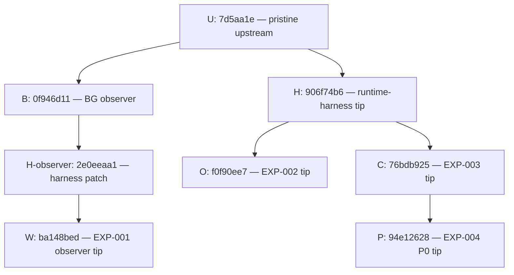

# bsnes Experimental Branch Publication Audit

**Status:** DRAFT — publication review only; no rewrite or publication authorized or performed.

**Date:** September 22, 2026.

## 1. Scope

Audit the five requested experimental branches and the separate native-output-bounds investigation branch in `upstream/bsnes/`. The only file created by this task is this report. Source, tests, commits, refs, remotes and experiment documentation were not changed. No tests, builds, ROMs, commits or pushes were run.

**SOURCE OBSERVATION** identifies inspected Git metadata, trees, diffs and source text. **INFERENCE** identifies publication recommendations. **UNKNOWN** identifies limits not established by this read-only audit. This is not a new verification of experiment behavior, a change to historical findings, or selection of bsnes as the GTC-HD foundation.

The baseline excludes upstream history from GTC-HD remediation. Branch-local comparisons use each experiment's actual parent foundation; inherited GTC-HD commits are audited once in the seven-commit union. Both added and removed diff lines and pre/post file versions were checked, so removal at a later tip would not hide a historical finding.

Coverage: six current trees; **7 unique GTC-HD commits**; **65 distinct changed-file blob versions**, including relevant preimages; **2,190 unique blobs** across current trees and those historical versions; and **32 distinct newly added paths**. Full-tree scans separate unchanged upstream matches from GTC-HD contributions. No upstream historical commit audit, object cleanup, or rewrite was attempted.

Source references below are textual paths relative to the bsnes repository at the cited commit. Linked documentation belongs to the GTC-HD repository. Ignored output locations and the discovered personal executable path are intentionally not reproduced.

## 2. Repository/baseline identity

| Item | Observed identity |
|---|---|
| Research repository | `<GTC-HD-Lab>` |
| Research repository HEAD at audit start | `f8bc552a5003dae91555659d309fa757a9215638` |
| Separate bsnes Git repository | `upstream/bsnes/` |
| Configured origin | `https://github.com/bsnes-emu/bsnes.git` |
| Existing remote names | `origin` only |
| Checked-out upstream branch | `master` |
| Audited upstream baseline, U | `7d5aa1e656b9171524d01b1b22917197d8121cb4` |
| Runtime-harness baseline, H | `906f74b6e5f4f2f4e62bb960d01aa68c9f55f919` |
| Composition implementation baseline, C | `76bdb9250befa62fcbf23fcff2ef962fe2f58215` |
| Repository completeness | Not shallow; no replacement refs |

**SOURCE OBSERVATION:** U is an ancestor of all six requested branch tips. All seven GTC-HD commits have exactly one parent; no GTC-HD merge commits or signed commits were found. The documentation repository, upstream checkout and all six linked experimental/investigation worktrees started clean. The investigation worktree is `experiments/bsnes-native-output-bounds/`; the runtime-harness worktree is `experiments/bsnes-exp-001-baseline/`.

The upstream commit and upstream authorship are outside the correction set. The pre-existing upstream tags and remote-tracking refs are not proposed rewrite targets.

## 3. Branch inventory

Comparison baseline means the parent foundation for that experiment, not necessarily U. Commit aliases resolve to exact SHAs and subjects below. Lists are in ancestry/chronological order.

| Branch | Current tip SHA | Comparison baseline SHA | Branch-local commits | Inherited GTC-HD commits |
|---|---|---|---|---|
| `gtc-hd/exp-001-runtime-harness` | `906f74b6e5f4f2f4e62bb960d01aa68c9f55f919` | `7d5aa1e656b9171524d01b1b22917197d8121cb4` | H | None |
| `gtc-hd/exp-001-passive-ppu-observation` | `ba148bedc74892722de93633ce08190dda406bf7` | `7d5aa1e656b9171524d01b1b22917197d8121cb4` | B → H-observer → W | None; H-observer is patch-equivalent to H, not its descendant |
| `gtc-hd/exp-002-obj-provenance` | `f0f90ee799969b735ca90b6dd9491219f0b9cc92` | `906f74b6e5f4f2f4e62bb960d01aa68c9f55f919` | O | H |
| `gtc-hd/exp-003-composition-provenance` | `76bdb9250befa62fcbf23fcff2ef962fe2f58215` | `906f74b6e5f4f2f4e62bb960d01aa68c9f55f919` | C | H |
| `gtc-hd/exp-004-color-math-provenance` | `94e12628b6dc9580e61fc3322be4a011328b0fe5` | `76bdb9250befa62fcbf23fcff2ef962fe2f58215` | P | H, C |
| `gtc-hd/investigate-native-output-bounds` | `7d5aa1e656b9171524d01b1b22917197d8121cb4` | `7d5aa1e656b9171524d01b1b22917197d8121cb4` | None | None |

The branch-local counts are **1, 3, 1, 1, 1, 0**, respectively: seven unique commits. Counting shared H or C again on descendant branches would inflate the remediation count.

### Commit catalogue and changed files

`A` means added and `M` means modified relative to that commit's parent. No GTC-HD commit deletes or renames a tracked file. All listed changes are meaningful experiment, harness, fixture, runner or supporting ignore/documentation work; no unrelated/noise-only commit was identified.

#### B — Implement EXP-001 passive BG provenance observer

- Commit: `0f946d112f045d5cf29a9e09876b15a592180b62`.
- Parent: `7d5aa1e656b9171524d01b1b22917197d8121cb4`.
- Author date: `2026-09-19T11:59:09-04:00`; committer date: `2026-09-19T11:59:09-04:00`.
- Classification: Meaningful BG observation instrumentation and synthetic host storage/export tests.

Changed files:

```text
M  bsnes/sfc/ppu/background.cpp
A  bsnes/sfc/ppu/exp001-observer.cpp
A  bsnes/sfc/ppu/exp001-observer.hpp
M  bsnes/sfc/ppu/ppu.cpp
A  tests/exp001/.gitignore
A  tests/exp001/observer-test.cpp
```

#### H — Add EXP-001 runtime validation harness

- Commit: `906f74b6e5f4f2f4e62bb960d01aa68c9f55f919`.
- Parent: `7d5aa1e656b9171524d01b1b22917197d8121cb4`.
- Author date: `2026-09-19T12:48:35-04:00`; committer date: `2026-09-19T12:48:35-04:00`.
- Classification: Meaningful frontend runtime-validation harness and synthetic frame-hash tests; no PPU provenance implementation.

Changed files:

```text
M  bsnes/target-bsnes/bsnes.cpp
A  bsnes/target-bsnes/program/exp001-frame-hash.hpp
M  bsnes/target-bsnes/program/platform.cpp
M  bsnes/target-bsnes/program/program.cpp
M  bsnes/target-bsnes/program/program.hpp
A  tests/exp001-runtime/.gitignore
A  tests/exp001-runtime/frame-hash-test.cpp
```

#### H-observer — Add EXP-001 runtime validation harness

- Commit: `2e0eeaa1580487f277e60f6ef55b9c74ca1026ae`.
- Parent: `0f946d112f045d5cf29a9e09876b15a592180b62`.
- Author date: `2026-09-19T12:48:35-04:00`; committer date: `2026-09-19T12:50:09-04:00`.
- Classification: Meaningful reuse of the same harness patch on the BG-observer line; intentional duplicate patch, not an incidental cleanup commit.

Changed files:

```text
M  bsnes/target-bsnes/bsnes.cpp
A  bsnes/target-bsnes/program/exp001-frame-hash.hpp
M  bsnes/target-bsnes/program/platform.cpp
M  bsnes/target-bsnes/program/program.cpp
M  bsnes/target-bsnes/program/program.hpp
A  tests/exp001-runtime/.gitignore
A  tests/exp001-runtime/frame-hash-test.cpp
```

#### W — Add EXP-001 observer runtime window controls

- Commit: `ba148bedc74892722de93633ce08190dda406bf7`.
- Parent: `2e0eeaa1580487f277e60f6ef55b9c74ca1026ae`.
- Author date: `2026-09-20T12:45:11-04:00`; committer date: `2026-09-20T12:45:11-04:00`.
- Classification: Meaningful callback-window controls and synthetic/frontend CLI tests for EXP-001.

Changed files:

```text
M  bsnes/target-bsnes/bsnes.cpp
A  bsnes/target-bsnes/program/exp001-observer-window.hpp
M  bsnes/target-bsnes/program/program.cpp
M  bsnes/target-bsnes/program/program.hpp
A  tests/exp001-runtime/observer-window-cli-test.py
A  tests/exp001-runtime/observer-window-test.cpp
```

#### O — Implement EXP-002 OBJ provenance observer

- Commit: `f0f90ee799969b735ca90b6dd9491219f0b9cc92`.
- Parent: `906f74b6e5f4f2f4e62bb960d01aa68c9f55f919`.
- Author date: `2026-09-20T20:13:42-04:00`; committer date: `2026-09-20T20:13:42-04:00`.
- Classification: Meaningful OBJ provenance instrumentation, runtime controller and native-method/synthetic host tests.

Changed files:

```text
A  bsnes/sfc/ppu/exp002-obj-observer.cpp
A  bsnes/sfc/ppu/exp002-obj-observer.hpp
M  bsnes/sfc/ppu/main.cpp
M  bsnes/sfc/ppu/object.cpp
M  bsnes/sfc/ppu/ppu.cpp
M  bsnes/sfc/ppu/serialization.cpp
M  bsnes/target-bsnes/bsnes.cpp
A  bsnes/target-bsnes/program/exp002-obj-window.hpp
M  bsnes/target-bsnes/program/program.cpp
M  bsnes/target-bsnes/program/program.hpp
A  tests/exp002/.gitignore
A  tests/exp002/obj-pipeline-test.cpp
A  tests/exp002/observer-window-cli-test.py
A  tests/exp002/observer-window-test.cpp
A  tests/exp002/run-tests.py
```

#### C — Implement EXP-003 composition provenance observer

- Commit: `76bdb9250befa62fcbf23fcff2ef962fe2f58215`.
- Parent: `906f74b6e5f4f2f4e62bb960d01aa68c9f55f919`.
- Author date: `2026-09-22T10:42:51-04:00`; committer date: `2026-09-22T10:42:51-04:00`.
- Classification: Meaningful composition provenance instrumentation, runtime controller and native-method/synthetic host tests.

Changed files:

```text
M  bsnes/sfc/ppu/background.cpp
A  bsnes/sfc/ppu/exp003-composition.cpp
A  bsnes/sfc/ppu/exp003-composition.hpp
A  bsnes/sfc/ppu/exp003-hooks.cpp
M  bsnes/sfc/ppu/main.cpp
M  bsnes/sfc/ppu/object.cpp
M  bsnes/sfc/ppu/ppu.cpp
M  bsnes/sfc/ppu/ppu.hpp
M  bsnes/sfc/ppu/screen.cpp
M  bsnes/sfc/ppu/serialization.cpp
M  bsnes/target-bsnes/bsnes.cpp
A  bsnes/target-bsnes/program/exp003-composition-window.hpp
M  bsnes/target-bsnes/program/program.cpp
M  bsnes/target-bsnes/program/program.hpp
A  tests/exp003/.gitignore
A  tests/exp003/composition-test.cpp
A  tests/exp003/observer-window-cli-test.py
A  tests/exp003/observer-window-test.cpp
A  tests/exp003/run-tests.py
```

#### P — Add EXP-004 P0 output bounds investigation tests

- Commit: `94e12628b6dc9580e61fc3322be4a011328b0fe5`.
- Parent: `76bdb9250befa62fcbf23fcff2ef962fe2f58215`.
- Author date: `2026-09-22T16:16:30-04:00`; committer date: `2026-09-22T16:16:30-04:00`.
- Classification: Meaningful P0 investigation fixtures, runner, README and ignore rule only; no EXP-004 color-math provenance implementation.

Changed files:

```text
A  tests/exp004-p0/.gitignore
A  tests/exp004-p0/README.md
A  tests/exp004-p0/layout-probe.cpp
A  tests/exp004-p0/output-bounds-test.cpp
A  tests/exp004-p0/run-tests.py
```

## 4. Branch dependency graph



The native-output-bounds investigation branch points **at U itself**, not at an experimental descendant.

**SOURCE OBSERVATION:**

- H and H-observer have the same subject and identical stable patch ID, `4dfea9d782d99ab5152b58e2f42555c835073acd`. Their parents differ. The runtime-harness branch is **not** an ancestor of the EXP-001 observer branch; their merge base is U. This supports patch equivalence, not a claim about the exact command originally used to copy the patch.
- EXP-002 and EXP-003 are sibling branches from H. Their merge base is H; EXP-003 does not descend from EXP-002 or the EXP-001 BG-observer branch.
- EXP-002/003 frontend controller comments identify adaptation from EXP-001. Code reuse does not establish Git ancestry.
- EXP-004 inherits H and C and adds only P's five test/documentation files. Native files in P are unchanged from C. EXP-004 color-math provenance remains unauthorized under the [current specification](../experiments/EXP-004/SPEC.md).
- The native-output-bounds branch has zero commits or tree differences above U. It has no experimental provenance code inherited from H, O, C or P.

**INFERENCE:** Future public comparisons should use the baseline/tip pairs in section 3. A runtime-harness-to-EXP-001-observer comparison is not an ancestry range for the observer's history. Cross-links should distinguish cumulative diffs from each experiment's own changes.

## 5. Author/committer audit

Desired public identity: **Xavier Laverde <xavier0286@gmail.com>**.

**SOURCE OBSERVATION:** Every GTC-HD commit needs an author-name and committer-name correction. Six also need both email fields corrected. Upstream commits are excluded.

| Alias / exact commit | Author | Committer | Difference from desired identity |
|---|---|---|---|
| B / `0f946d112f045d5cf29a9e09876b15a592180b62` | `Abslan Laverde <xavier0286@gmail.com>` | `Abslan Laverde <xavier0286@gmail.com>` | Both names use the old Abslan identity; emails already match |
| H / `906f74b6e5f4f2f4e62bb960d01aa68c9f55f919` | `abslan laverde <abslan.laverde@gmail.com>` | `abslan laverde <abslan.laverde@gmail.com>` | Both names and emails use the old Abslan identity |
| H-observer / `2e0eeaa1580487f277e60f6ef55b9c74ca1026ae` | `abslan laverde <abslan.laverde@gmail.com>` | `abslan laverde <abslan.laverde@gmail.com>` | Both names and emails use the old Abslan identity |
| W / `ba148bedc74892722de93633ce08190dda406bf7` | `abslan laverde <abslan.laverde@gmail.com>` | `abslan laverde <abslan.laverde@gmail.com>` | Both names and emails use the old Abslan identity |
| O / `f0f90ee799969b735ca90b6dd9491219f0b9cc92` | `abslan laverde <abslan.laverde@gmail.com>` | `abslan laverde <abslan.laverde@gmail.com>` | Both names and emails use the old Abslan identity |
| C / `76bdb9250befa62fcbf23fcff2ef962fe2f58215` | `abslan laverde <abslan.laverde@gmail.com>` | `abslan laverde <abslan.laverde@gmail.com>` | Both names and emails use the old Abslan identity |
| P / `94e12628b6dc9580e61fc3322be4a011328b0fe5` | `abslan laverde <abslan.laverde@gmail.com>` | `abslan laverde <abslan.laverde@gmail.com>` | Both names and emails use the old Abslan identity |

Totals: **7 commits**, **14 name fields**, **12 email fields**. No GitHub noreply address was found. Author and committer name/email agree within each commit; the inconsistency is with the desired public identity, including capitalization differences between B and the other commits. H-observer's later committer timestamp is not an author/committer identity mismatch. No identity finding is assigned to the zero-commit investigation branch.

## 6. Path/privacy audit

Scans covered drive-letter/user-profile paths, Windows and Unix home-directory forms, workspace-root strings, mounted-data paths, file URLs, Miniconda, absolute tool locations, Markdown destinations, private ROM/SRAM/settings/capture paths, and source/test command strings. Full current trees and every GTC-HD diff's additions/deletions were inspected; changed-file snapshots were also scanned.

**SOURCE OBSERVATION:** There are **10 offending source lines in 7 distinct files, introduced by 4 GTC-HD commits**. One is a personal user-profile Python executable; the other nine are fixed MSYS2 installation paths. The literals are described without republishing the machine-local locations.

| Introducing commit | Source location at that commit | Finding | Current affected branches |
|---|---|---|---|
| W `ba148bedc74892722de93633ce08190dda406bf7` | `tests/exp001-runtime/observer-window-cli-test.py:20` | Fixed Windows MSYS2 UCRT64 binary directory prepended to PATH | EXP-001 observer |
| O `f0f90ee799969b735ca90b6dd9491219f0b9cc92` | `tests/exp002/observer-window-cli-test.py:20` | Same fixed PATH prefix | EXP-002 |
| O | `tests/exp002/run-tests.py:22`, `:23` | Fixed PATH prefix and compiler executable | EXP-002 |
| C `76bdb9250befa62fcbf23fcff2ef962fe2f58215` | `tests/exp003/observer-window-cli-test.py:20` | Fixed PATH prefix | EXP-003 and EXP-004 |
| C | `tests/exp003/run-tests.py:21`, `:22` | Fixed PATH prefix and compiler executable | EXP-003 and EXP-004 |
| P `94e12628b6dc9580e61fc3322be4a011328b0fe5` | `tests/exp004-p0/README.md:7` | Personal Windows user-profile Miniconda executable in reproduction command | EXP-004 |
| P | `tests/exp004-p0/run-tests.py:22`, `:24` | Fixed PATH prefix and compiler executable | EXP-004 |

H, B and H-observer introduce no machine-local path finding. All ten problematic lines remain in their relevant current trees; no additional deleted-only GTC-HD path leak was found. A later cleanup commit alone would leave the original literals in publishable ancestry.

The MSYS2 literals are portability problems, not credentials. The README executable is also a personal workstation-location disclosure. No hardcoded GTC-HD ROM, SRAM, save-state, settings-seed or capture location was found. Runtime arguments and worktree-relative generated-output paths are not themselves evidence of private captured data.

The baseline scan also produced **30 path-pattern line matches and 137 email-pattern line matches in unchanged upstream blobs**, present identically across the six trees. These are not GTC-HD remediation items: matches include upstream platform path handling, examples, attribution, and syntax false positives. Examples occur in `nall/path.hpp`, upstream SameBoy build documentation, libretro headers and shaders. The upstream history/attribution must not be rewritten to eliminate such scanner matches.

**INFERENCE:** Replace personal reproduction commands with `python` or a documented `<PYTHON>` placeholder. Make test compiler/runtime discovery configurable through the intended environment or a documented compiler/toolchain setting. Preserve the supported Windows/MSYS2 requirements and compiler evidence; path cleanup must not imply untested cross-platform support.

## 7. Secret/private-data audit

**SOURCE OBSERVATION:** No GTC-HD-added access token, password, API key, credential URL, SSH/private key, authentication cookie, or unrelated personal identifier was detected in commit messages or inspected content/history. Checks included recognizable token/key signatures, credential assignments, email strings, credential keywords and unusually long encoded payloads; no long encoded payload candidates were found in added lines.

The old author/committer names and emails are the identity findings in section 5. The personal executable path is the privacy finding in section 6. Neither is a discovered access secret.

No GTC-HD-committed ROM, SRAM, save state, raw capture or screenshot was found. CLI tests construct an ordinary text argument-existence sentinel and reject inputs before normal ROM/settings initialization; that test source is not ROM content. C++ fixtures use synthetic state and source-defined constants, not committed game data. Generated output filename strings are not generated output files.

**UNKNOWN:** A local static scan cannot certify absence of every possible disguised secret or establish provenance of every source line. No account checks, credential validation, network access, ROM execution or upstream-history secret audit occurred.

## 8. Generated/binary-content audit

**SOURCE OBSERVATION:**

- All GTC-HD changed entries are regular `100644` blobs. No symlink, submodule, executable/object binary, archive, committed build directory, log, CSV capture, screenshot, ROM/save file or temporary artifact was added.
- No changed blob contains a NUL byte or has a binary diff entry. All newly added files are C++/Python source, five scoped ignore files, or the P0 README.
- No changed-file blob exceeds **1 MiB**. The largest newly added file is `tests/exp003/composition-test.cpp`, **16,205 bytes**.
- Each test family has a `.gitignore` with `/build/`: `tests/exp001/`, `tests/exp001-runtime/`, `tests/exp002/`, `tests/exp003/`, and `tests/exp004-p0/`.
- P's generated native-method copies, CSVs and executables are runner outputs, not files committed by P. Generated output locations are omitted here.
- Images/assets and other binary material already present at U are unchanged upstream material, not newly introduced experimental evidence.

**INFERENCE:** The committed fixtures are useful research source. There is no GTC-HD-generated binary payload requiring history removal in the inspected ranges.

## 9. Licensing observations

**SOURCE OBSERVATION:** All seven license-named baseline files remain at identical Git blob IDs in every audited branch:

```text
LICENSE.txt
bsnes/gb/.github/actions/LICENSE
bsnes/gb/Cocoa/License.html
bsnes/gb/HexFiend/License.txt
bsnes/gb/LICENSE
bsnes/gb/iOS/License.html
libco/LICENSE
```

No GTC-HD diff removes/replaces a license file or removes an existing copyright/license/SPDX notice from a modified upstream file. The upstream root README and its credits are unchanged.

The root `LICENSE.txt` identifies bsnes under GPL version 3 or later and separately records terms for bundled components including libco/nall/ruby/hiro. Existing upstream component notices remain the relevant repository evidence; this report does not assert a single license for every bundled file.

New experiment code references the existing bsnes/nall code, C++ standard headers and Python standard-library modules. Native-method fixtures include/extract upstream methods; EXP-002/003 frontend comments identify adaptation from EXP-001. No newly vendored third-party library, downloaded implementation, new attribution claim, or new external code package was identified.

**INFERENCE:** Preserve all upstream notices and clearly attribute the fork and included native-method fixtures. No specific new third-party attribution gap was detected from repository evidence. This is not a legal clearance or proof of source authorship; further review is needed if any externally copied material not identified in the repository is known to exist.

## 10. Visitor/readability observations

Every branch's root README is still the upstream bsnes README, with upstream feature descriptions, credits and download links. It does not explain GTC-HD experiment scope or the branch's baseline. This is preserved upstream material, but is insufficient orientation for a research-fork visitor.

| Branch | What a visitor can infer from committed material | Missing context / useful GTC-HD cross-link |
|---|---|---|
| Runtime harness | `exp001-frame-hash.hpp` calls itself frontend-only validation; tests are in `tests/exp001-runtime/` | Link the [runtime-harness results](../experiments/EXP-001/RUNTIME_HARNESS_RESULTS.md), baseline and exact role |
| EXP-001 observer | Diagnostic header explicitly says temporary/non-production; BG and runtime tests are in `tests/exp001/` and `tests/exp001-runtime/` | Link [EXP-001 spec](../experiments/EXP-001/SPEC.md) and [results](../experiments/EXP-001/RESULTS.md); explain the parallel harness history |
| EXP-002 | Observer/controller names and comments identify OBJ capture; tests are in `tests/exp002/`; runner pins H | Link [EXP-002 spec](../experiments/EXP-002/SPEC.md) and [results](../experiments/EXP-002/RESULTS.md); distinguish sibling ancestry from conceptual predecessor |
| EXP-003 | Comments identify copied-value experimental diagnostics; tests are in `tests/exp003/`; runner pins H | Link [EXP-003 spec](../experiments/EXP-003/SPEC.md) and [results](../experiments/EXP-003/RESULTS.md); explain independent composition instrumentation |
| EXP-004 | `tests/exp004-p0/README.md` explicitly says prerequisite tests only, no provenance implementation or repair | Link the [spec gate](../experiments/EXP-004/SPEC.md), [P0 report](../experiments/EXP-004/P0_OUTPUT_BOUNDS_REPORT.md) and [matrix](../experiments/EXP-004/P0_OUTPUT_BOUNDS_MATRIX.csv); label the branch as EXP-003 plus P0 |
| Native-output-bounds investigation | No investigation-specific committed content; tree is U | Link the P0 disposition and source-archaeology scope only when there is useful investigation material |

### P0 reproducibility blocker

**SOURCE OBSERVATION:** At P, `tests/exp004-p0/run-tests.py:15` pins C, while line 42 asserts that HEAD equals that baseline. P is a child of C, not C itself. Thus the published branch tip cannot pass this assertion on its documented invocation. This is a static conclusion; the runner was not executed. The README's HEAD-pinning description matches the pre-commit investigation workflow, when these test files were not yet committed.

The runner also checks the branch name at line 43 and performs native-source equality checks against C. A renamed public branch or rewritten baseline requires coordinated treatment. Simply changing the baseline literal to P would conflate test publication with the native-source baseline and does not solve future self-referential commit pinning.

**INFERENCE:** Before presenting P0 as reproducible from a public clone, define a baseline policy that permits the committed test-only descendant while retaining the exact native-source checks. Address the strict HEAD guard and README together in a separately authorized publication fix. This does not authorize a native bounds repair or EXP-004 implementation.

No branch README or cross-link was added by this audit.

## 11. Per-branch publication status

These classifications describe the current inspected tips, not rewritten successors.

| Branch | Classification | Reason |
|---|---|---|
| `gtc-hd/exp-001-runtime-harness` | **NEEDS IDENTITY REWRITE** | H uses the old identity; no GTC-HD path/secret/binary finding |
| `gtc-hd/exp-001-passive-ppu-observation` | **NEEDS IDENTITY REWRITE + NEEDS CONTENT SANITIZATION + NEEDS HISTORY SANITIZATION** | B/H-observer/W identities; W's fixed toolchain path |
| `gtc-hd/exp-002-obj-provenance` | **NEEDS IDENTITY REWRITE + NEEDS CONTENT SANITIZATION + NEEDS HISTORY SANITIZATION** | H/O identities; O's fixed toolchain paths |
| `gtc-hd/exp-003-composition-provenance` | **NEEDS IDENTITY REWRITE + NEEDS CONTENT SANITIZATION + NEEDS HISTORY SANITIZATION** | H/C identities; C's fixed toolchain paths |
| `gtc-hd/exp-004-color-math-provenance` | **NEEDS IDENTITY REWRITE + NEEDS CONTENT SANITIZATION + NEEDS HISTORY SANITIZATION** | H/C/P identities; inherited fixed paths; P's personal Python path and fixed toolchain; P0 invocation blocker |
| `gtc-hd/investigate-native-output-bounds` | **NOT YET USEFUL TO PUBLISH** | Identity/content unchanged from U, but no branch-specific research commit; hold separately |

No completed-experiment branch is unconditionally **READY TO PUBLISH** as inspected. The investigation branch has no GTC-HD remediation count; its classification is about usefulness, not a newly discovered upstream privacy defect.

## 12. Required remediation

**INFERENCE — proposed work, not performed:**

1. Correct author and committer metadata on exactly the seven GTC-HD commits to the desired identity. A display-only mailmap would not correct the underlying commit metadata.
2. Remove the personal executable location and normalize toolchain discovery in the four introducing commits W/O/C/P. Current-tip edits alone do not sanitize those histories.
3. Resolve P0's committed-tip HEAD guard while retaining native baseline/source identity and its test-only scope. Preserve historical P0 findings and recorded metrics.
4. Remap executable baseline references when ancestors are rewritten:
   - `tests/exp002/run-tests.py:24`: H.
   - `tests/exp003/run-tests.py:23`: H; inherited by EXP-004.
   - `tests/exp004-p0/run-tests.py:15,42,43,171`: C, strict HEAD/branch policy and source comparison.
   - `tests/exp004-p0/README.md:9`: baseline/HEAD description.
5. Add visitor orientation/cross-links in a later documentation task; distinguish P0 investigation from unimplemented color-math provenance.
6. Re-audit rewritten refs and independently validate any changed runner behavior under a separately authorized task. Preserve the original evidence as historical evidence, not a claim that a rewritten build was already tested.

No upstream licensing modification or binary-payload purge is proposed.

## 13. Proposed history-rewrite plan, if needed

**INFERENCE: rewriting is required to meet the requested raw public identity and remove machine-local literals from GTC-HD history.** It is not authorized or performed by this audit.

1. **Back up first, privately.** Record all six original branch tips and their trees. Create private backup refs for the original heads and a verified offline Git bundle before any rewrite. Keep those refs/bundles out of the public fork and out of any all-ref/mirror push.
2. **Freeze U and upstream refs.** Use U as the unchanged boundary. Do not rewrite U, its ancestors, upstream authors, `master`, origin refs or upstream tags. Use an isolated publication-preparation clone rather than rewriting checked-out research branches in place.
3. **Preserve the DAG and order.** Recreate the B → H-observer → W line and the H → O / H → C → P line, applying one original commit at a time with corrected author and committer fields. Preserve subjects and dates where practical. Keep the two patch-equivalent harness commits on their existing parent lines; collapsing them would change the experiment ancestry unnecessarily.
4. **Keep tree changes narrowly scoped.** For B, H and H-observer, preserve identical trees. For W/O/C/P, allow only the reviewed path/publication fixes, required baseline remapping, and the explicit P0 reproduction-policy correction. Do not alter native emulation, observation semantics, fixture calculations or recorded conclusions. Review each changed blob against the original.
5. **Build an old-to-new SHA map as parents are recreated.** H's replacement must be known before updating O/C runners; C's replacement must be known before updating P's baseline policy and README. Do not retain old GTC-HD objects in a public history merely to satisfy stale runner literals.
6. **Update dependent refs coherently.** Use the dependency table below; do not partially publish branches whose parent or pinned source is absent.
7. **Verify before publication.** Compare unchanged source/tree portions, changed files, metadata, parent edges, license blob IDs, source pins and complete rewritten history scans. Validate runner changes separately; no such execution occurred here. Publish only explicitly selected sanitized branch refs after authorization, never private backup refs.
8. **Preserve historical evidence.** Retain original SHAs in a clearly labeled historical-to-public mapping and existing research records. Use replacement SHAs for new public source/comparison links. Do not relabel historical executable hashes or measurements as results from a new build.

| Rewritten commit/line | Branches that must receive replacement ancestry |
|---|---|
| B or H-observer | EXP-001 passive observer; descendants H-observer/W as applicable |
| W | EXP-001 passive observer tip |
| H | Runtime harness, EXP-002, EXP-003 and EXP-004 |
| O | EXP-002 tip |
| C | EXP-003 and EXP-004 |
| P | EXP-004 tip |
| U | **Must remain unchanged**; native-output-bounds investigation remains at U |

All **seven** GTC-HD commit SHAs and all **five** experimental branch tips will change after identity correction, even if a commit's tree is identical. Descendants also change because their parent IDs change. Exact replacement SHAs cannot be stated before the reviewed rewrite inputs are finalized. U and the investigation branch tip must retain their current SHA.

## 14. Proposed public-fork branch set

**INFERENCE — after remediation and authorization:**

- Publish the sanitized runtime-harness branch as the common validation reference.
- Publish the sanitized EXP-001 observer, EXP-002 OBJ and EXP-003 composition branches, retaining their distinct ancestry and experiment labels.
- Publish the sanitized EXP-004 branch only with explicit **EXP-003 + P0 test-only investigation** context and a corrected reproducible invocation. Its name must not be treated as evidence that EXP-004 color-math provenance exists.
- Keep `gtc-hd/investigate-native-output-bounds` local until it contains useful source-archaeology material or there is an explicit reason to publish an empty branch. It is not part of the completed-experiment branch set.
- Keep an unchanged upstream baseline available as the source/comparison foundation. Do not publish backup refs, local generated artifacts or private inputs.

The eventual GitHub fork URL is not established by this audit; no new remote or public source URL was invented.

## 15. Remaining risks

- **UNKNOWN:** This static audit is not a guarantee against every encoded secret, source-authorship issue or untested runtime effect.
- No experiments, compiler invocations or ROMs were executed. Existing passivity/build results retain their original documented scope.
- P0's baseline gate is already incompatible with the committed tip; a rewrite would add further stale-SHA risks unless runner pins and the policy are addressed together.
- Fixed toolchain paths encode supported-environment assumptions. Sanitizing them does not establish support for other compilers, operating systems or ABIs.
- A branch-only public view would currently lack experiment orientation. The upstream README's release links describe upstream bsnes, not experimental GTC-HD builds.
- Unchanged upstream history, bundled assets, contributor identities and licensing are not certified by this GTC-HD-specific audit.
- Retaining/publishing backup refs or stale branches would re-expose the original metadata/path history. Explicit ref selection and a complete history re-scan are required after any rewrite.
- The native output-bounds defect and EXP-004 implementation gate are unchanged. Publication preparation must not become an unreviewed native repair.

## 16. Recommendation

**INFERENCE:** Do not publish the current experimental tips yet. Prepare one separately authorized, backed-up rewrite of the seven GTC-HD commits, combining exact identity correction with narrowly scoped publication/portability fixes and coordinated baseline-pin updates. Re-audit the resulting five experimental branches before generating public comparison links.

Keep the native-output-bounds branch separate and at pristine U until its own source-archaeology scope produces publishable material. No emulator selection, native repair, EXP-004 implementation, history rewrite or publication follows from this report.
